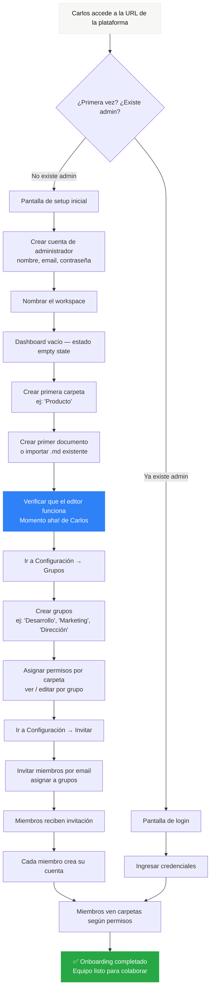
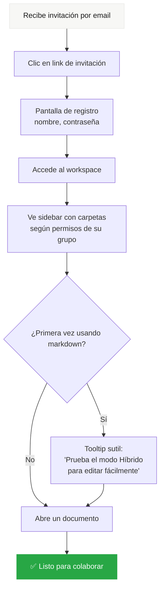
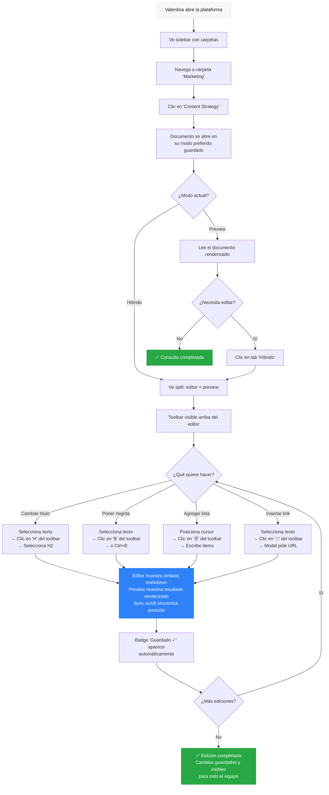
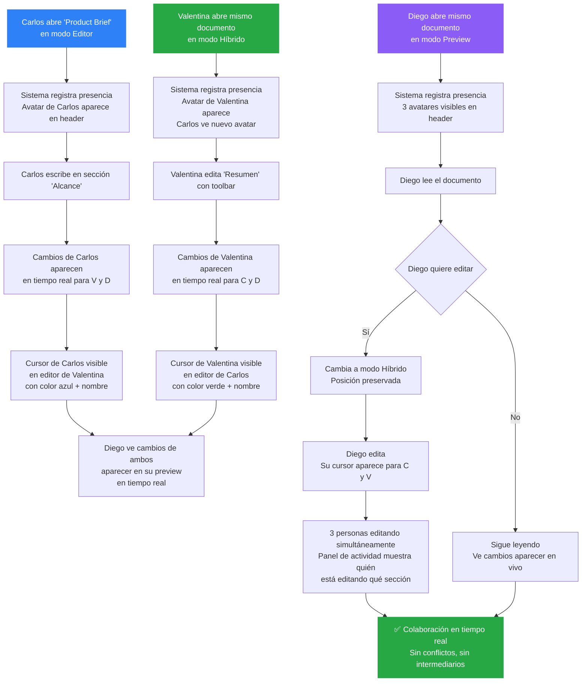
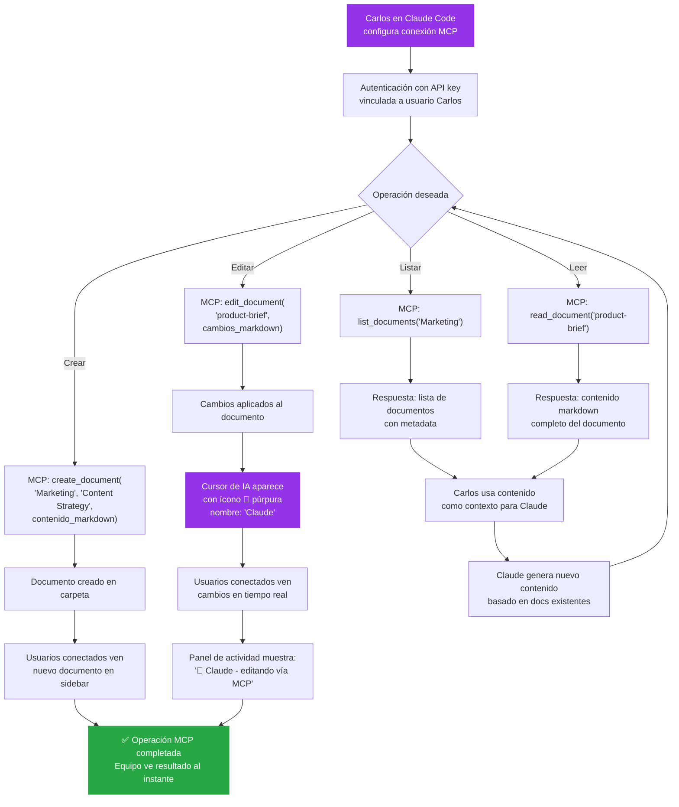
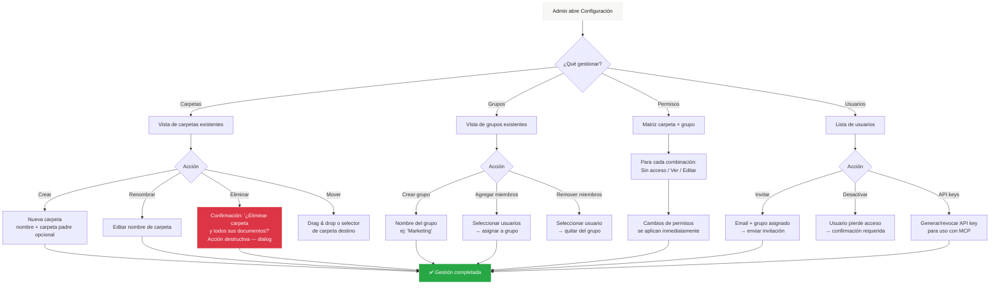

# UX Design Specification markdown

**Author:** Juan David
**Date:** 2026-03-19

---

## Executive Summary

### Visión del Proyecto

**markdown** es una plataforma web colaborativa de edición de documentos markdown, self-hosted y gratuita, diseñada para equipos pequeños multidisciplinarios que generan documentación con herramientas de IA. La plataforma cierra el ciclo entre generación de contenido con IA (vía MCP) y colaboración humana en tiempo real, eliminando al desarrollador como intermediario y convirtiendo la documentación en una fuente única de verdad accesible para todo el equipo.

La experiencia UX debe balancear dos mundos: la eficiencia técnica de un editor de código para desarrolladores, y la accesibilidad visual de herramientas como Notion para usuarios no técnicos — todo sobre una base 100% markdown nativa.

### Usuarios Objetivo

**Carlos — El Desarrollador / Generador IA**
- Perfil técnico avanzado, domina markdown y herramientas de IA
- Interactúa principalmente desde editor puro o directamente vía MCP desde Claude Code
- Necesita: velocidad, atajos de teclado, sin fricción visual innecesaria
- Dolor principal: ser el cuello de botella de todos los cambios documentales del equipo

**Valentina — La Marketer / No Técnica**
- No conoce sintaxis markdown ni quiere aprenderla
- Necesita editar documentos con confianza usando asistencia visual (toolbar + preview)
- Colabora frecuentemente en tiempo real como documentadora de proyectos
- Dolor principal: depender de alguien más para hacer cambios en documentos que ella entiende mejor que nadie en su dominio

**Diego — El Fundador / Product Owner**
- Perfil semi-técnico, consulta más de lo que edita
- Necesita visión rápida del estado actual de cualquier documento
- Edita ocasionalmente usando modo híbrido
- Dolor principal: trabajar con versiones desactualizadas y perder correcciones

### Desafíos Clave de Diseño

1. **Tres modos, una experiencia coherente**: El editor puro, el visualizador y el modo híbrido deben sentirse como parte de la misma aplicación, con transiciones fluidas entre ellos. El cambio de modo no debe desorientar al usuario ni perder contexto (posición en el documento, selección, etc.)

2. **Responsive con funcionalidad completa**: La plataforma debe ser completamente usable en desktop, tablet y móvil. El modo híbrido (split view) presenta un desafío particular en pantallas pequeñas — necesitará una adaptación inteligente (posiblemente tabs en lugar de split en móvil). La gestión de carpetas y la navegación de documentos deben ser cómodas en touch.

3. **Colaboración en tiempo real sin ruido visual**: Múltiples usuarios editarán simultáneamente de forma frecuente. Los cursores, selecciones y cambios de otros deben ser visibles pero no intrusivos. La experiencia debe ser natural, no abrumadora — especialmente para Valentina que ya tiene la barrera del markdown.

4. **Navegación escalable**: Con decenas a cientos de documentos organizados en carpetas (muchos generados por IA para alimentar contexto), la estructura de navegación debe escalar sin volverse caótica. Búsqueda global, breadcrumbs y una jerarquía clara son fundamentales.

5. **Toolbar de asistencia que empodere sin estorbar**: El toolbar debe ser suficiente para que Valentina nunca necesite memorizar sintaxis, pero no debe ocupar espacio ni distraer a Carlos que no lo necesita. Debe ser contextual y adaptable.

### Oportunidades de Diseño

1. **Referentes visuales sólidos (Notion + HackMD)**: Tomar la limpieza y elegancia de navegación de Notion para la gestión de documentos/carpetas y la experiencia general, combinado con la efectividad del split view de HackMD para el modo híbrido. Esto da una base visual familiar y validada.

2. **Presencia colaborativa como diferenciador**: La colaboración en tiempo real sobre markdown puro es algo que las alternativas gratuitas no ofrecen. Hacer que la presencia de otros usuarios (avatares, cursores con nombre, indicadores de "editando") sea una experiencia premium y natural puede ser un diferenciador fuerte.

3. **Transición progresiva de modos**: Oportunidad de diseñar una experiencia donde Valentina empiece en visualizador, haga clic en un texto para editarlo y entre naturalmente al modo híbrido — reduciendo la barrera de entrada sin forzar la elección de modo por adelantado.

4. **Integración MCP transparente**: Cuando Carlos edita vía MCP/IA, los demás usuarios ven los cambios en tiempo real. Oportunidad de mostrar sutilmente que "un agente de IA está editando" (ícono de bot en lugar de avatar), haciendo visible el flujo IA-humano de forma elegante.

## Core User Experience

### Experiencia Definitoria

La acción core de **markdown** es **abrir un documento y empezar a editar/ver cambios en tiempo real**. Todo en la plataforma debe orbitar alrededor de esta acción: desde que el usuario hace clic en un documento hasta que está editando o viendo ediciones colaborativas, la fricción debe ser cero.

El producto se define por la fluidez de esta experiencia: no importa si eres Carlos escribiendo markdown puro, Valentina usando el toolbar, o Diego consultando el visualizador — todos deben llegar al contenido en máximo 2 clics y sentir que la herramienta desaparece para dejar al documento como protagonista.

### Estrategia de Plataforma

**Plataforma:** Aplicación web responsive (sin app nativa en MVP)
**Conectividad:** Online obligatorio — la colaboración en tiempo real es el core del producto
**Entrada primaria:** Mouse/teclado en desktop, touch en móvil/tablet

**Adaptación por dispositivo:**

| Dispositivo | Modos disponibles | Comportamiento del modo híbrido |
|-------------|-------------------|-------------------------------|
| **Desktop** | Editor, Visualizador, Híbrido (split) | Split horizontal: editor izquierda + preview derecha. Toolbar visible |
| **Tablet landscape** | Editor, Visualizador, Híbrido (split) | Split horizontal como desktop, toolbar colapsable |
| **Tablet portrait** | Editor, Visualizador, Híbrido (tabs) | Tabs switcheables: Editor ↔ Preview. Toolbar visible |
| **Móvil** | Editor, Visualizador, Híbrido (tabs) | Tabs switcheables: Editor ↔ Preview. Toolbar compacto |

**Principio clave:** En móvil y tablet portrait se muestran solo 2 opciones de vista (tabs) para maximizar el espacio útil y evitar interfaces saturadas. El split view se reserva para pantallas que lo puedan sostener sin comprometer la legibilidad.

### Interacciones sin Fricción

Las siguientes interacciones deben sentirse completamente naturales y sin esfuerzo:

1. **Cambio de modos sin pérdida de contexto**: Al alternar entre editor, visualizador e híbrido, la posición exacta en el documento se preserva. El usuario nunca pierde de vista dónde estaba. La transición es instantánea y animada suavemente.

2. **Colaboración en tiempo real invisible**: Los cambios de otros usuarios aparecen fluidamente en el documento sin interrumpir la edición propia. Los cursores remotos son visibles pero sutiles (color + nombre), y nunca causan saltos en el scroll ni desplazan el texto que estás editando.

3. **Toolbar que hace markdown accesible**: Valentina selecciona texto, presiona "Negrita" en el toolbar, y ve simultáneamente el `**texto**` aparecer en el editor y el **texto** renderizado en el preview. La curva de aprendizaje es cero — si sabes usar Google Docs, sabes usar el toolbar.

4. **Edición vía MCP transparente**: Cuando Carlos edita desde Claude Code vía MCP, los cambios aparecen en tiempo real para todos los usuarios conectados, exactamente igual que si estuviera editando desde la interfaz web. Un indicador sutil (ícono de bot + nombre) muestra que es una edición de IA.

### Momentos Críticos de Éxito

**Momento 1 — Primera edición colaborativa:**
Valentina abre un documento que Carlos acaba de crear vía MCP, cambia al modo híbrido, usa el toolbar para corregir un título, y ve su cambio reflejado instantáneamente. Carlos, desde Claude Code, ve el cambio de Valentina. Este es el momento "aha!" que valida toda la plataforma.

**Momento 2 — Confianza en la fuente única de verdad:**
Diego abre la plataforma, navega a la carpeta del proyecto, y encuentra el documento actualizado con los últimos cambios de todo el equipo. El historial le muestra quién cambió qué. No necesita preguntar "¿esta es la última versión?" nunca más.

**Momento 3 — Onboarding de usuario no técnico:**
Valentina llega a la plataforma por primera vez, ve la interfaz limpia estilo Notion, abre un documento en modo visualizador, y cuando necesita editar, el modo híbrido con toolbar le permite hacerlo sin miedo. En menos de 5 minutos está colaborando.

**Momento que arruina todo (evitar):**
Un usuario pierde cambios porque la sincronización falló silenciosamente o porque dos personas editaron la misma línea y el conflicto se resolvió mal. La confianza se destruye y el equipo vuelve a compartir archivos por chat.

### Principios de Experiencia

1. **El documento es el protagonista**: La interfaz debe desaparecer. Minimizar chrome, bordes y elementos decorativos. El contenido ocupa el máximo espacio posible. Inspirado en la limpieza de Notion.

2. **Colaboración natural, no forzada**: La presencia de otros usuarios enriquece la experiencia sin imponerla. Los indicadores colaborativos son informativos pero nunca intrusivos. No hay notificaciones molestas durante la edición.

3. **Accesible sin dumbing down**: El toolbar y el modo híbrido hacen markdown accesible para Valentina sin simplificar la experiencia de Carlos. Cada usuario tiene su modo ideal, y la herramienta se adapta en lugar de imponer un mínimo común denominador.

4. **Responsive por diseño, no por adaptación**: La experiencia en cada dispositivo está pensada nativamente (tabs en móvil, split en desktop), no es un desktop comprimido. Cada breakpoint tiene su propia lógica de interacción.

5. **Confianza por transparencia**: Historial de cambios siempre accesible, indicadores de quién está editando, guardado automático visible. El usuario nunca debe dudar si sus cambios se guardaron o si está viendo la versión correcta.

## Desired Emotional Response

### Objetivos Emocionales Primarios

Cada persona del equipo debe experimentar una emoción central diferente que valide el valor de la plataforma para su rol:

| Persona | Emoción primaria | Manifestación |
|---------|-----------------|---------------|
| **Carlos** (Desarrollador) | **Alivio y liberación** | "Ya no soy el intermediario. El equipo se autogestiona con los documentos." |
| **Valentina** (Marketer) | **Confianza y autonomía** | "Puedo editar esto sola. No necesito pedir ayuda para cambiar un título." |
| **Diego** (Fundador) | **Control y claridad** | "Sé exactamente qué está pasando con la documentación. Todo está actualizado." |

**Emoción unificadora del equipo:** **Conexión y alineación** — "Estamos todos en la misma página, literalmente."

### Mapa del Viaje Emocional

**Descubrimiento (primera vez que ven la plataforma):**
- Sensación deseada: **Familiaridad** — "Esto se parece a Notion, ya sé cómo funciona"
- Evitar: intimidación por la palabra "markdown" o una interfaz demasiado técnica

**Onboarding (primeros 5 minutos):**
- Sensación deseada: **Facilidad** — "Esto fue rápido, ya estoy dentro"
- Evitar: frustración por pasos innecesarios o configuración compleja

**Primera edición:**
- Sensación deseada: **Empoderamiento** — "¡Lo hice! Puedo editar markdown sin saberlo"
- Evitar: miedo a "romper algo" o inseguridad sobre si el cambio se guardó

**Colaboración en tiempo real:**
- Sensación deseada: **Asombro sutil** — "Puedo ver lo que están escribiendo en este momento, qué genial"
- Evitar: ansiedad por cambios simultáneos o sensación de que alguien puede sobreescribir tu trabajo

**Uso recurrente (día a día):**
- Sensación deseada: **Productividad natural** — la herramienta desaparece, solo queda el trabajo
- Evitar: fatiga por notificaciones, complejidad acumulada o lentitud

**Cuando algo sale mal (desconexión, error):**
- Sensación deseada: **Tranquilidad** — "Mis cambios están seguros, el sistema se está reconectando"
- Evitar: pánico, incertidumbre sobre si los datos se perdieron

### Micro-Emociones Críticas

**Confianza sobre Confusión:**
- El usuario siempre debe saber dónde está, qué está editando, y si sus cambios se guardaron. Indicadores de estado claros y constantes: "Guardado", "Guardando...", "Reconectando...".

**Autonomía sobre Dependencia:**
- Valentina nunca debe sentir que necesita a Carlos para hacer un cambio. El toolbar y el modo híbrido deben ser suficientes para que cualquier edición sea posible sin conocimiento técnico.

**Logro sobre Frustración:**
- Cada acción completada (guardar, crear documento, cambiar modo) debe tener un feedback visual sutil que confirme el éxito. Micro-animaciones que dicen "hecho" sin interrumpir el flujo.

**Pertenencia sobre Aislamiento:**
- Los avatares de usuarios conectados, los cursores con nombre y el historial de cambios deben transmitir que "no estás trabajando solo" — el equipo está ahí, colaborando contigo.

### Implicaciones de Diseño

**Confianza y Autonomía → Feedback constante y sutil:**
- Indicador de estado de guardado siempre visible pero discreto (ícono en header, no modal)
- Micro-animaciones de confirmación al completar acciones (check sutil, transición suave)
- Mensajes de reconexión calmados y específicos: "Reconectando... tus cambios se guardarán automáticamente" en lugar de un error genérico

**Familiaridad → Patrones de navegación conocidos:**
- Sidebar de carpetas/documentos al estilo Notion (colapsable, jerárquico)
- Breadcrumbs para ubicación contextual
- Atajos de teclado estándar (Ctrl+B para negrita, Ctrl+S para guardar, etc.)

**Empoderamiento → Toolbar inteligente y contextual:**
- Toolbar visible por defecto en modo híbrido, ocultable para usuarios avanzados
- Tooltips breves que explican qué hace cada botón del toolbar
- Feedback inmediato: presionar "Negrita" en toolbar → ver `**texto**` en editor y **texto** en preview simultáneamente

**Conexión → Presencia colaborativa elegante:**
- Avatares de usuarios conectados en el header del documento (máximo 3-4 visibles + "+N")
- Cursores remotos con nombre y color asignado, visibles pero no dominantes
- Indicador de "IA editando" con ícono de bot cuando las ediciones vienen vía MCP

**Tranquilidad ante errores → Manejo graceful de desconexión:**
- Banner no intrusivo (no modal) que indica estado de conexión
- Los cambios locales se preservan durante la desconexión y se sincronizan al reconectar
- Nunca mostrar errores técnicos crudos — siempre mensajes humanos y tranquilizadores

### Principios de Diseño Emocional

1. **Feedback invisible pero presente**: Cada acción tiene confirmación visual, pero nunca interrumpe el flujo. El usuario siente que "todo funciona" sin pensar en ello.

2. **Errores sin drama**: Los estados de error (desconexión, conflicto, fallo de guardado) se comunican con calma, claridad y una solución. Nunca pánico, nunca mensajes técnicos, nunca modales bloqueantes.

3. **Progresión de confianza**: La interfaz permite que Valentina empiece con acciones seguras (visualizar) y progrese naturalmente a acciones más complejas (editar en híbrido). La confianza se construye gradualmente, no se exige desde el inicio.

4. **Presencia humana constante**: Los indicadores de colaboración recuerdan que hay personas reales trabajando juntas. La edición colaborativa no es una feature técnica — es una experiencia social y de equipo.

5. **La herramienta desaparece**: En el uso recurrente, la interfaz debe ser tan predecible y fluida que el usuario olvida que está usando una herramienta. Solo queda el contenido y la colaboración.

## UX Pattern Analysis & Inspiration

### Análisis de Productos Inspiradores

#### Notion — Referente de Navegación y Estética

**Lo que hace bien:**
- **Sidebar jerárquico colapsable**: Navegación por carpetas/páginas con expansión progresiva. El usuario siempre sabe dónde está sin sentirse perdido, incluso con cientos de documentos
- **El contenido es el protagonista**: Chrome mínimo, márgenes generosos, tipografía limpia. La interfaz desaparece y solo queda el documento
- **Transiciones suaves**: Cambios de vista, apertura de páginas, y expansión de menús se sienten fluidos y naturales
- **Dark/Light mode**: Implementación elegante que mantiene la legibilidad y jerarquía visual en ambos temas
- **Breadcrumbs contextuales**: Siempre visible la ruta completa del documento, permitiendo navegación rápida hacia arriba en la jerarquía

**Patrón a adoptar para markdown:** La estructura completa de navegación — sidebar colapsable + breadcrumbs + área de contenido maximizada. Este patrón ya está validado para gestionar cientos de documentos en carpetas.

#### HackMD — Referente de Edición Markdown Colaborativa

**Lo que hace bien:**
- **Split view editor/preview**: División clara entre el código markdown y el resultado renderizado, con proporción ajustable
- **Sync scroll preciso**: Al hacer scroll en el editor, el preview se sincroniza a la posición correspondiente y viceversa
- **Toolbar de markdown**: Barra de herramientas funcional que inserta sintaxis markdown sin necesidad de memorizarla
- **3 modos de vista**: Cambio rápido entre editor puro, split, y preview — exactamente el patrón que necesitamos

**Patrón a adoptar para markdown:** El sistema completo de modos de vista y el toolbar de asistencia. HackMD ya validó que este modelo funciona para hacer markdown accesible.

#### Figma — Referente de Colaboración en Tiempo Real

**Lo que hace bien:**
- **Cursores en tiempo real con nombre y avatar**: Cada colaborador tiene un cursor de color con su nombre, visible pero no intrusivo. Se siente como estar en la misma sala
- **Indicadores de presencia**: Avatares en la esquina superior muestran quién está conectado, con estado activo/inactivo
- **Historial de versiones visual**: Timeline de cambios con nombre de quien modificó, timestamp, y capacidad de restaurar cualquier versión anterior
- **Sistema de comentarios**: Comentarios anclados a posiciones específicas del contenido, con hilos de conversación, resolución, y mención de personas
- **Observar a otro usuario**: Posibilidad de "seguir" el cursor de otro usuario para ver qué está haciendo en tiempo real

**Patrón a adoptar para markdown:** El modelo de presencia colaborativa completo — cursores con nombre, avatares de usuarios conectados, y la filosofía de que la colaboración se siente natural y social. El sistema de comentarios de Figma como referencia futura (post-MVP) para comentarios en documentos.

### Patrones UX Transferibles

**Patrones de Navegación:**

| Patrón | Origen | Aplicación en markdown |
|--------|--------|----------------------|
| Sidebar jerárquico colapsable | Notion | Navegación principal de carpetas y documentos |
| Breadcrumbs contextuales | Notion | Ubicación del documento actual dentro de la jerarquía |
| Búsqueda global con Cmd/Ctrl+K | Notion + VS Code | Acceso rápido a cualquier documento sin navegar por carpetas |

**Patrones de Interacción:**

| Patrón | Origen | Aplicación en markdown |
|--------|--------|----------------------|
| Split view con proporción ajustable | HackMD | Modo híbrido editor + preview |
| Sync scroll bidireccional | HackMD | Sincronización entre editor y preview en modo híbrido |
| Toolbar de inserción markdown | HackMD | Asistencia para usuarios no técnicos |
| Cambio de modo con toggle rápido | HackMD | Alternancia entre editor/visualizador/híbrido |

**Patrones de Colaboración:**

| Patrón | Origen | Aplicación en markdown |
|--------|--------|----------------------|
| Cursores remotos con nombre y color | Figma | Visibilidad de ediciones de otros en tiempo real |
| Avatares de presencia | Figma | Header del documento muestra quién está conectado |
| Timeline de versiones | Figma | Historial de cambios con autor, fecha, y restauración |
| Indicador de "IA editando" | Original | Ícono de bot cuando las ediciones vienen vía MCP |

### Anti-Patrones a Evitar

1. **Modales bloqueantes para acciones frecuentes**: No usar pop-ups que requieran confirmación para guardar, cambiar modo, o crear documentos. Las acciones frecuentes deben ser instantáneas (patrón de Notion: clic = acción).

2. **Sidebar que no colapsa o que ocupa demasiado espacio**: En móvil especialmente, el sidebar debe ser un overlay que se cierra al seleccionar un documento, no un panel permanente que robe espacio al contenido.

3. **Preview que no sincroniza con el editor**: Un split view donde el preview no se actualiza en tiempo real o no sincroniza el scroll genera desconfianza y frustración. Debe ser instantáneo.

4. **Toolbar sobrecargado**: Evitar un toolbar con 30+ botones que intimide en lugar de asistir. Priorizar las acciones más comunes (headers, negrita, cursiva, listas, links, código, imágenes) y agrupar las menos usadas en menús secundarios.

5. **Notificaciones intrusivas durante la edición**: No interrumpir la escritura con banners, modales o sonidos cuando alguien se conecta o hace un cambio. La presencia de otros debe ser visible pero pasiva.

6. **Historial de cambios inaccesible o confuso**: El historial no debe estar enterrado en un menú de configuración. Debe ser accesible con 1 clic desde el documento, con una timeline clara y la opción de restaurar.

### Estrategia de Inspiración de Diseño

**Adoptar directamente:**
- Sidebar jerárquico de Notion → navegación principal de carpetas/documentos
- Split view + sync scroll de HackMD → modo híbrido
- Toolbar de asistencia markdown de HackMD → empoderamiento de usuarios no técnicos
- Cursores remotos con nombre de Figma → presencia colaborativa
- Avatares de usuarios conectados de Figma → indicador de presencia en header
- Timeline de versiones de Figma → historial de cambios

**Adaptar para nuestro contexto:**
- Búsqueda global Cmd/Ctrl+K → adaptada para buscar contenido dentro de documentos, no solo títulos
- Sistema de modos de HackMD → adaptar a tabs en móvil/tablet portrait en lugar de split
- Presencia de Figma → agregar indicador especial para ediciones vía MCP/IA (ícono de bot)

**Evitar conscientemente:**
- La complejidad visual de editores como Confluence o SharePoint
- Los tiempos de carga que a veces sufre Notion con documentos grandes
- Interfaces que parecen IDEs y alejan a usuarios no técnicos
- Over-engineering de features de colaboración que distraigan del contenido

## Design System Foundation

### Elección del Sistema de Diseño

**Sistema elegido:** shadcn/ui + Tailwind CSS

shadcn/ui es una colección de componentes reutilizables construidos sobre Radix UI (primitivas headless con accesibilidad nativa) y estilizados con Tailwind CSS. A diferencia de librerías tradicionales como MUI o Ant Design, los componentes se copian directamente al proyecto — no son una dependencia externa. Esto otorga control total sobre cada componente, facilita la personalización profunda, y permite que contribuidores open source modifiquen componentes sin depender de versiones externas.

### Justificación de la Selección

| Factor | Evaluación |
|--------|-----------|
| **Velocidad de desarrollo** | Alta — componentes listos para usar con estética moderna por defecto |
| **Personalización** | Máxima — los componentes viven en el proyecto, se modifican directamente |
| **Estética** | Limpia y minimalista por defecto, alineada con el referente Notion |
| **Dark/Light mode** | Soporte nativo con CSS variables y Tailwind |
| **Accesibilidad** | Incorporada vía Radix UI (WAI-ARIA, navegación por teclado, screen readers) |
| **Responsive** | Tailwind CSS tiene sistema de breakpoints nativo y utilities para responsive |
| **Comunidad open source** | Enorme — Tailwind y shadcn/ui son de los ecosistemas más activos en frontend |
| **Contribuciones externas** | Fácil — los contribuidores trabajan con Tailwind estándar, sin aprender un framework propietario |
| **Mantenibilidad** | Alta — sin dependencia de versiones externas, los componentes son código propio |
| **Curva de aprendizaje** | Moderada — requiere conocer Tailwind, pero la documentación es excelente |

**¿Por qué no las otras opciones?**

- **Custom Design System**: Demasiado esfuerzo inicial para un proyecto open source que necesita velocidad. shadcn/ui da la misma flexibilidad sin empezar de cero.
- **Material Design / Ant Design**: Estética reconocible que haría que markdown se vea como "otra app de Google" o "otro dashboard enterprise". No alineado con la limpieza tipo Notion.
- **MUI / Chakra UI**: Dependencias pesadas que agregan complejidad al bundle y dificultan la personalización profunda necesaria para lograr la estética deseada.

### Enfoque de Implementación

**Stack de diseño:**
- **Tailwind CSS** — Sistema de utilidades para estilos, breakpoints responsive, y tematización
- **shadcn/ui** — Componentes base (Button, Input, Dialog, Dropdown, Tabs, Sidebar, etc.)
- **Radix UI** (vía shadcn/ui) — Primitivas accesibles para componentes complejos (Popover, Tooltip, Select, etc.)
- **CSS Variables** — Design tokens para colores, espaciado, tipografía, bordes — base del sistema de temas

**Componentes de shadcn/ui a utilizar directamente:**

| Componente | Uso en markdown |
|-----------|----------------|
| `Sidebar` | Navegación principal de carpetas/documentos |
| `Tabs` | Cambio de modos (editor/visualizador/híbrido) y tabs en móvil |
| `Button` | Acciones del toolbar, botones de acción |
| `Input` / `Textarea` | Campos de búsqueda, renombrar documentos |
| `Dialog` | Confirmaciones críticas (eliminar documento, revertir versión) |
| `Dropdown Menu` | Menús contextuales (clic derecho en documentos, opciones de carpeta) |
| `Tooltip` | Hints del toolbar y acciones |
| `Avatar` | Indicadores de presencia de usuarios conectados |
| `Badge` | Estados (guardado, editando, reconectando) |
| `Breadcrumb` | Navegación contextual dentro de la jerarquía |
| `Sheet` | Sidebar en móvil (overlay lateral) |
| `Command` | Paleta de comandos Cmd/Ctrl+K |
| `Scroll Area` | Scroll del sidebar y del editor |
| `Toggle` | Dark/Light mode switch |
| `Separator` | División visual entre secciones del sidebar |

**Componentes custom a construir:**

| Componente | Descripción |
|-----------|-------------|
| `MarkdownEditor` | Editor de código markdown con syntax highlighting (basado en CodeMirror o Monaco) |
| `MarkdownPreview` | Renderizador de markdown a HTML con estilos consistentes |
| `MarkdownToolbar` | Barra de herramientas para inserción de sintaxis markdown |
| `SplitView` | Panel dividido con resize handle para modo híbrido |
| `CollaborativeCursor` | Cursor remoto con nombre y color de otros usuarios |
| `PresenceIndicator` | Grupo de avatares de usuarios conectados al documento |
| `VersionTimeline` | Historial de cambios con timeline visual |
| `SyncScroll` | Lógica de sincronización de scroll entre editor y preview |
| `ConnectionStatus` | Banner de estado de conexión (conectado/reconectando) |

### Estrategia de Personalización

**Design Tokens (CSS Variables):**

```
--background, --foreground          → Colores base
--primary, --primary-foreground     → Color de acento principal
--muted, --muted-foreground         → Elementos secundarios
--accent, --accent-foreground       → Elementos interactivos
--destructive                       → Acciones destructivas (eliminar)
--border, --ring                    → Bordes y focus rings
--radius                            → Border radius global
--sidebar-*                         → Tokens específicos del sidebar
```

**Tematización:**
- **Light mode**: Fondo blanco limpio, texto oscuro, acentos sutiles — inspirado en Notion
- **Dark mode**: Fondo oscuro (no negro puro), texto claro, acentos que mantienen contraste — inspirado en Notion dark
- Cambio de tema instantáneo sin recarga, con preferencia persistida por usuario

**Tipografía:**
- Sans-serif limpia para la interfaz (Inter o similar)
- Monospace para el editor markdown (JetBrains Mono, Fira Code, o similar)
- Tipografía del preview configurable para máxima legibilidad del contenido renderizado

## Core User Experience — Experiencia Definitoria

### Experiencia Definitoria

> **"Genera documentación con IA, edítala con tu equipo en tiempo real — sin importar si sabes markdown o no"**

Esta frase captura los 4 pilares del producto:
1. **Generación con IA** — El contenido nace desde herramientas como Claude Code vía MCP
2. **Colaboración en tiempo real** — El equipo trabaja junto sobre la misma fuente de verdad
3. **Markdown nativo** — Todo es markdown por debajo, potente y portable
4. **Accesible para todos** — 3 modos de interacción que se adaptan al perfil de cada usuario

La experiencia definitoria no es solo "editar markdown" — es el ciclo completo: **IA genera → equipo colabora → IA consume contexto actualizado**. Este ciclo cerrado es lo que ninguna alternativa ofrece hoy.

### Modelo Mental del Usuario

**Carlos (Desarrollador) — Modelo mental: IDE / Terminal**
- Viene de VS Code, terminales, y herramientas CLI
- Su expectativa: escribir código/texto con velocidad, atajos de teclado, sin distracciones visuales
- Modelo mental de archivos: carpetas y archivos, como un sistema de archivos local
- Modelo mental de IA: MCP es una extensión natural de su flujo de trabajo con Claude Code
- **Adaptación en markdown:** El modo editor puro + integración MCP se alinea perfectamente con su modelo mental. No necesita aprender nada nuevo.

**Valentina (Marketer) — Modelo mental: Google Docs / Notion**
- Viene de herramientas WYSIWYG donde "lo que ves es lo que obtienes"
- Su expectativa: hacer clic, escribir, dar formato con botones — sin código visible
- Modelo mental de archivos: páginas organizadas en carpetas, como Notion o Google Drive
- Modelo mental de colaboración: como Google Docs — ves el cursor del otro y los cambios aparecen
- **Adaptación en markdown:** El modo híbrido con toolbar es su puente. El toolbar le da los botones que espera (negrita, listas, headers), el preview le muestra el resultado visual que necesita, y el editor le revela gradualmente que "markdown no es tan difícil". Con el tiempo, puede transicionar naturalmente hacia más confianza con la sintaxis.

**Diego (Fundador) — Modelo mental: Dashboard / Documento final**
- Viene de leer documentos finales, presentaciones, y reportes
- Su expectativa: abrir, leer contenido limpio y actualizado, hacer correcciones puntuales
- Modelo mental de archivos: como un repositorio de documentos organizados por proyecto
- Modelo mental de historial: como Google Docs — "¿quién cambió esto y cuándo?"
- **Adaptación en markdown:** El visualizador es su punto de entrada natural. Cuando necesita editar, el modo híbrido le da la asistencia necesaria sin forzarlo a aprender sintaxis.

**El modo híbrido como puente universal:**
Los 3 modos existen para que cada usuario trabaje en su zona de comfort, pero el modo híbrido es el punto de convergencia donde cualquier perfil puede ser productivo. Carlos puede ignorar el toolbar y escribir markdown directo en el panel izquierdo. Valentina puede usar exclusivamente el toolbar y el preview. Diego puede ver el resultado renderizado y hacer ediciones puntuales. Un solo modo, 3 formas de usarlo.

### Criterios de Éxito de la Experiencia Core

**"Esto simplemente funciona" — Indicadores de éxito:**

| Criterio | Métrica de éxito | Persona principal |
|----------|-----------------|-------------------|
| Tiempo de clic a edición | < 2 segundos desde abrir documento hasta estar editando | Todos |
| Latencia de colaboración | < 200ms para ver cambios de otros usuarios | Todos |
| Primera edición sin ayuda | Valentina edita un documento sola en < 5 minutos de onboarding | Valentina |
| Ciclo IA completo | Carlos genera vía MCP y el equipo ve cambios en < 1 segundo | Carlos |
| Confianza en el guardado | El usuario nunca pregunta "¿se guardó?" — el indicador es siempre visible | Todos |
| Encontrar un documento | < 10 segundos para localizar cualquier documento vía búsqueda o navegación | Diego |
| Historial útil | < 3 clics para ver quién cambió qué y restaurar una versión | Diego |
| Cambio de modo sin fricción | Cambiar de modo preserva posición y contexto, transición < 300ms | Todos |

**"Esto es mejor que lo que tenía" — Diferenciadores de éxito:**

- Valentina deja de enviar correcciones por WhatsApp/email y edita directamente
- Carlos deja de ser el intermediario y solo genera contenido vía MCP
- Diego abre la plataforma en lugar de pedir "la última versión" por chat
- El equipo deja de mantener archivos locales duplicados

### Patrones UX: Establecidos vs. Novedosos

**Patrones establecidos que adoptamos (sin reinventar):**

| Patrón | Referente | Uso en markdown |
|--------|----------|----------------|
| Sidebar colapsable con jerarquía | Notion, VS Code | Navegación de carpetas/documentos |
| Split view editor/preview | HackMD, VS Code | Modo híbrido |
| Toolbar de formateo | Google Docs, HackMD | Asistencia markdown para no técnicos |
| Cursores colaborativos con nombre | Figma, Google Docs | Presencia en tiempo real |
| Breadcrumbs | Notion, sistemas de archivos | Ubicación contextual |
| Cmd/Ctrl+K command palette | Notion, VS Code, Linear | Búsqueda rápida global |
| Dark/Light mode toggle | Universal | Preferencia visual del usuario |

**Combinaciones novedosas (nuestra innovación):**

| Innovación | Descripción |
|-----------|-------------|
| **Cursor de IA** | Cuando una herramienta de IA edita vía MCP, aparece un cursor con ícono de bot y nombre de la herramienta — el equipo ve en tiempo real cómo la IA genera contenido |
| **3 modos como espectro** | No son 3 herramientas separadas — son un espectro continuo donde el usuario puede moverse fluidamente. El modo híbrido es el centro de gravedad que conecta el mundo técnico (editor) con el visual (preview) |
| **Toolbar → aprendizaje progresivo** | El toolbar no solo inserta sintaxis — gradualmente enseña markdown. Valentina empieza usando botones y con el tiempo reconoce que `**negrita**` no es tan difícil |
| **MCP como ciudadano de primera clase** | La integración MCP no es un add-on — es un modo de interacción tan válido como el editor web. Los cambios vía MCP tienen la misma presencia visual que los cambios humanos |

### Mecánicas de la Experiencia Core

**1. Iniciación — Llegar al documento:**

```
Usuario abre la app → Ve sidebar con carpetas/documentos
                    → O usa Cmd/Ctrl+K para buscar por nombre/contenido
                    → Hace clic en un documento
                    → El documento se abre en su modo preferido (recordado por usuario)
                    → Está listo para leer o editar en < 2 segundos
```

**2. Interacción — Editar el documento:**

```
Modo Editor Puro:
  Usuario escribe markdown directamente → Syntax highlighting en tiempo real
  Atajos de teclado disponibles (Ctrl+B, Ctrl+I, etc.)
  Sin distracciones — solo el código markdown

Modo Híbrido:
  Panel izquierdo: editor markdown con toolbar
  Panel derecho: preview renderizado en tiempo real
  Toolbar: botones para insertar sintaxis → se refleja en ambos paneles
  Sync scroll: al navegar en un panel, el otro sigue
  En móvil/tablet portrait: tabs switcheables Editor ↔ Preview

Modo Visualizador:
  Documento renderizado completo, solo lectura
  Navegación fluida del contenido
  Clic en "Editar" → cambia a modo híbrido en la posición actual

Vía MCP (Carlos desde Claude Code):
  Conecta al servidor MCP → Lista carpetas y documentos
  Lee, edita, o crea documentos → Cambios aparecen en tiempo real para todos
  Cursor de IA visible para usuarios conectados
```

**3. Feedback — Saber que funciona:**

```
Guardado:     Indicador "Guardado ✓" en header, siempre visible
Colaboración: Cursores de otros usuarios con nombre y color
Conexión:     Badge verde "Conectado" → amarillo "Reconectando..." → verde "Conectado"
Edición IA:   Ícono de bot + nombre cuando MCP está editando
Toolbar:      Feedback inmediato — botón presionado → sintaxis insertada → preview actualizado
Error:        Banner sutil con mensaje humano y acción clara, nunca modal bloqueante
```

**4. Completitud — Flujo cerrado:**

```
El documento se guarda automáticamente → no hay botón "Guardar"
El historial registra cada cambio con autor y timestamp
El usuario puede cerrar el browser y volver — todo persiste
Otros usuarios ven el estado actualizado al instante
La IA puede consumir el documento actualizado vía MCP para futuros contextos
→ Ciclo cerrado: IA genera → equipo edita → IA consume contexto actualizado
```

## Visual Design Foundation

### Sistema de Color

**Filosofía cromática:** Neutral y profesional — la interfaz no compite con el contenido. Los colores son funcionales, no decorativos. Inspirado en la paleta de Notion: grises cálidos, fondos limpios, y un único color de acento para acciones e indicadores importantes.

**Paleta Light Mode:**

| Token | Color | Uso |
|-------|-------|-----|
| `--background` | `#FFFFFF` | Fondo principal del área de contenido |
| `--background-secondary` | `#F7F7F5` | Fondo del sidebar, headers secundarios |
| `--foreground` | `#1A1A1A` | Texto principal |
| `--foreground-secondary` | `#6B6B6B` | Texto secundario, placeholders, metadata |
| `--muted` | `#F0F0EE` | Fondos de hover, elementos inactivos |
| `--border` | `#E8E8E5` | Bordes sutiles, separadores |
| `--primary` | `#2F81F7` | Acento principal — botones primarios, links, indicadores activos |
| `--primary-foreground` | `#FFFFFF` | Texto sobre fondo primary |
| `--destructive` | `#DC3545` | Acciones destructivas (eliminar documento/carpeta) |
| `--success` | `#28A745` | Estado conectado, guardado exitoso |
| `--warning` | `#F59E0B` | Estado reconectando, advertencias |

**Paleta Dark Mode:**

| Token | Color | Uso |
|-------|-------|-----|
| `--background` | `#191919` | Fondo principal (no negro puro, reduce fatiga visual) |
| `--background-secondary` | `#202020` | Fondo del sidebar |
| `--foreground` | `#E8E8E5` | Texto principal |
| `--foreground-secondary` | `#9B9B9B` | Texto secundario |
| `--muted` | `#2C2C2C` | Fondos de hover |
| `--border` | `#333333` | Bordes sutiles |
| `--primary` | `#4A9EFF` | Acento principal (ligeramente más claro para contraste en dark) |
| `--primary-foreground` | `#FFFFFF` | Texto sobre fondo primary |
| `--destructive` | `#F85149` | Acciones destructivas |
| `--success` | `#3FB950` | Estado conectado |
| `--warning` | `#D29922` | Estado reconectando |

**Colores de colaboración (cursores remotos):**
Paleta de 8 colores asignados automáticamente a cada usuario conectado, con suficiente contraste tanto en light como dark mode:

| # | Color | Hex Light | Hex Dark |
|---|-------|-----------|----------|
| 1 | Azul | `#2F81F7` | `#4A9EFF` |
| 2 | Verde | `#28A745` | `#3FB950` |
| 3 | Naranja | `#F5A623` | `#D29922` |
| 4 | Púrpura | `#8B5CF6` | `#A78BFA` |
| 5 | Rosa | `#EC4899` | `#F472B6` |
| 6 | Teal | `#14B8A6` | `#2DD4BF` |
| 7 | Rojo | `#EF4444` | `#F87171` |
| 8 | Amarillo | `#CA8A04` | `#FACC15` |

**Color del cursor de IA (MCP):**
- Color único diferenciado: `#9333EA` (púrpura intenso) con ícono de bot — visualmente distinto de los cursores humanos

### Sistema Tipográfico

**Fuentes seleccionadas:**

| Rol | Fuente | Fallback | Justificación |
|-----|--------|----------|---------------|
| **Interfaz (UI)** | Inter | system-ui, -apple-system, sans-serif | Legibilidad excepcional en tamaños pequeños, neutral, amplio soporte de pesos |
| **Editor markdown** | JetBrains Mono | Fira Code, Consolas, monospace | Diseñada para código, ligaduras opcionales, caracteres distinguibles |
| **Preview renderizado** | Inter | system-ui, sans-serif | Consistencia con la UI, excelente para lectura de contenido largo |

**Escala tipográfica (base 16px):**

| Elemento | Tamaño | Peso | Line Height | Uso |
|----------|--------|------|-------------|-----|
| `h1` | 32px / 2rem | 700 (Bold) | 1.3 | Título del documento en preview |
| `h2` | 24px / 1.5rem | 600 (Semibold) | 1.35 | Secciones principales |
| `h3` | 20px / 1.25rem | 600 (Semibold) | 1.4 | Subsecciones |
| `h4` | 16px / 1rem | 600 (Semibold) | 1.5 | Encabezados menores |
| `body` | 16px / 1rem | 400 (Regular) | 1.7 | Texto de contenido en preview — line height generoso para legibilidad |
| `body-sm` | 14px / 0.875rem | 400 (Regular) | 1.5 | Texto de interfaz, sidebar, metadata |
| `caption` | 12px / 0.75rem | 400 (Regular) | 1.5 | Timestamps, badges, labels secundarios |
| `code` | 14px / 0.875rem | 400 (Regular) | 1.6 | Código inline y editor markdown |

**Principios tipográficos:**
- Line height de 1.7 en body para máxima legibilidad en documentos largos
- Peso semibold (600) para headers en lugar de bold agresivo — más elegante y amigable
- Tamaño mínimo de 12px para accesibilidad — nada más pequeño en la interfaz
- Editor markdown usa 14px para mayor densidad de contenido sin sacrificar legibilidad

### Espaciado y Layout

**Sistema de espaciado (base 4px):**

| Token | Valor | Uso típico |
|-------|-------|-----------|
| `--space-1` | 4px | Espaciado mínimo entre ícono y texto |
| `--space-2` | 8px | Padding interno de badges, gaps pequeños |
| `--space-3` | 12px | Padding de botones, gaps de toolbar |
| `--space-4` | 16px | Padding de cards, gaps entre elementos |
| `--space-5` | 20px | Padding de secciones del sidebar |
| `--space-6` | 24px | Margin entre bloques de contenido |
| `--space-8` | 32px | Margin entre secciones |
| `--space-10` | 40px | Padding lateral del área de contenido |
| `--space-12` | 48px | Márgenes superiores de página |
| `--space-16` | 64px | Espaciado mayor entre secciones principales |

**Layout principal (desktop):**

```
┌─────────────────────────────────────────────────────┐
│  Header (48px altura)                               │
│  [Logo] [Breadcrumbs]    [Búsqueda] [Avatares] [⚙] │
├──────────┬──────────────────────────────────────────┤
│ Sidebar  │  Área de contenido                       │
│ (260px)  │  (márgenes laterales: 40-80px)           │
│          │                                          │
│ Carpetas │  Contenido centrado                      │
│ y docs   │  (max-width: 900px)                      │
│          │                                          │
│ Colapsa  │  Espacioso y limpio                      │
│ ble      │                                          │
│          │                                          │
└──────────┴──────────────────────────────────────────┘
```

**Layout modo híbrido (desktop):**

```
┌─────────────────────────────────────────────────────┐
│  Header + Toolbar de markdown                       │
├──────────┬────────────────────┬─────────────────────┤
│ Sidebar  │  Editor markdown   │  Preview renderizado│
│ (260px)  │  (50%)             │  (50%)              │
│          │                    │                      │
│          │  Monospace 14px    │  Sans-serif 16px     │
│          │  Fondo ligeramente │  Fondo blanco        │
│          │  diferente         │  Márgenes amplios    │
│          │                    │                      │
│          │  ← resize handle → │                      │
└──────────┴────────────────────┴─────────────────────┘
```

**Layout móvil:**

```
┌──────────────────────┐
│ Header (48px)        │
│ [☰] [Título] [👤👤]  │
├──────────────────────┤
│ [Editor] [Preview]   │  ← Tabs switcheables
├──────────────────────┤
│                      │
│  Contenido           │
│  (padding: 16px)     │
│                      │
│                      │
├──────────────────────┤
│ Toolbar compacto     │
│ (scroll horizontal)  │
└──────────────────────┘
```

**Principios de layout:**
- **Contenido centrado con max-width:** El texto de preview nunca excede 900px de ancho — líneas demasiado largas dificultan la lectura. En pantallas anchas, el contenido se centra con márgenes generosos a los lados.
- **Sidebar como navegación, no como protagonista:** 260px de ancho por defecto, colapsable con un clic. En móvil se convierte en sheet overlay.
- **Aire entre elementos:** Espaciado generoso entre bloques de contenido (24-32px). La interfaz respira, no se siente apretada. Esto beneficia tanto a técnicos como no técnicos.
- **Header compacto:** 48px de altura — suficiente para breadcrumbs, avatares de presencia, y controles esenciales sin robar espacio al contenido.

**Border radius:**

| Elemento | Radius | Justificación |
|----------|--------|---------------|
| Botones | 6px | Suave pero no infantil |
| Cards/contenedores | 8px | Consistente con shadcn/ui |
| Avatares | 50% (circular) | Estándar para fotos de perfil |
| Inputs | 6px | Consistente con botones |
| Modales/dialogs | 12px | Ligeramente más redondeado para diferenciarse |
| Tooltips | 6px | Compactos y limpios |

### Consideraciones de Accesibilidad

**Contraste:**
- Texto principal sobre fondo: ratio mínimo 7:1 (WCAG AAA)
- Texto secundario sobre fondo: ratio mínimo 4.5:1 (WCAG AA)
- Elementos interactivos: ratio mínimo 3:1 contra fondo adyacente
- Colores de cursores colaborativos verificados en ambos temas

**Navegación por teclado:**
- Todos los elementos interactivos accesibles via Tab
- Focus rings visibles (2px solid con offset) usando `--ring` color
- Atajos de teclado para acciones frecuentes (Cmd/Ctrl+B, I, K, etc.)
- Skip links para navegar directamente al contenido

**Tamaños mínimos:**
- Targets touch: mínimo 44x44px en móvil (WCAG 2.5.5)
- Texto mínimo: 12px (nunca menor)
- Íconos: mínimo 16x16px, con labels o tooltips

**Preferencias del sistema:**
- Respetar `prefers-color-scheme` para tema inicial
- Respetar `prefers-reduced-motion` para desactivar animaciones
- Respetar `prefers-contrast` para modo de alto contraste

## Design Direction Decision

### Direcciones Exploradas

Se generaron 6 direcciones de diseño visual, cada una explorando un enfoque diferente:

| # | Dirección | Enfoque | Referente principal |
|---|-----------|---------|-------------------|
| 1 | Notion Classic | Sidebar prominente, contenido centrado | Notion |
| 2 | HackMD Focus | Split view protagonista, toolbar visible | HackMD |
| 3 | Minimal Zen | Chrome cero, sidebar oculto, inmersión total | iA Writer, Typora |
| 4 | Dashboard Pro | Header robusto, búsqueda prominente, filtros | Confluence, Linear |
| 5 | **Collaborative First** | Presencia de usuarios central, actividad en vivo | **Figma** |
| 6 | Hybrid Smart | Combinación adaptativa de todas las direcciones | Notion + HackMD + Figma |

Showcase interactivo disponible en: `_bmad-output/planning-artifacts/ux-design-directions.html`

### Dirección Elegida

**Dirección 5: Collaborative First** — con modificaciones

La colaboración en tiempo real es el diferenciador principal de **markdown** frente a las alternativas gratuitas existentes. Esta dirección hace que la presencia de otros usuarios (humanos y de IA) sea un elemento central de la experiencia, no un añadido secundario. El equipo siempre sabe quién está editando qué, y el flujo IA-humano es visible y natural.

**Modificaciones aplicadas:**

1. **Panel de Actividad en vivo togglable:**
   - Botón de toggle en el header del documento (ícono de actividad/timeline)
   - Al activar: panel lateral derecho (280px) se desliza mostrando actividad en vivo + historial
   - Al desactivar: el panel se oculta y el área de contenido recupera todo el espacio
   - Estado del toggle se recuerda por usuario (preferencia persistida)
   - Por defecto: oculto en móvil/tablet, visible en desktop

2. **Avatares compactos con tooltip en hover:**
   - En el header: solo círculos con inicial/avatar (24px), sin nombres
   - Al hacer hover sobre un avatar: tooltip con nombre completo y estado ("Editando", "Viendo")
   - Máximo 4 avatares visibles + indicador "+N" si hay más
   - Cursor de IA (MCP): círculo púrpura con ícono de bot, tooltip muestra "Claude — editando vía MCP"
   - En el documento: los cursores remotos mantienen su flag con nombre (necesario para saber quién edita dónde)

**Elementos core de la dirección elegida:**

- **Header:** Logo + breadcrumbs + badge de guardado + mode tabs + avatares compactos + toggle de actividad
- **Sidebar izquierdo:** Jerarquía de carpetas/documentos estilo Notion (260px, colapsable)
- **Área de contenido:** Adaptativa según modo (preview centrado, split en híbrido, editor full en editor puro)
- **Panel de actividad (derecho, togglable):** Actividad en vivo arriba + historial de cambios abajo
- **Toolbar:** Visible en modos editor e híbrido, oculto en preview
- **Cursores remotos:** Visibles en el documento con color + nombre (flag en el cursor, no en el header)
- **Indicador de IA:** Cursor púrpura con ícono de bot cuando MCP está editando

### Justificación del Diseño

**¿Por qué Collaborative First?**

1. **Alineación con la propuesta de valor:** El diferenciador de markdown es la colaboración sobre markdown con integración MCP. La dirección elegida hace que este diferenciador sea visible y tangible desde el primer momento.

2. **Resuelve el problema de raíz:** El problema que resolvemos es que Carlos era el intermediario. Esta dirección hace explícito que ya no lo es — se puede ver en tiempo real cómo Valentina, Diego, y Claude contribuyen al documento simultáneamente.

3. **Adopción del equipo no técnico:** Valentina ve la actividad en vivo y entiende inmediatamente que está trabajando con su equipo, no sola frente a un editor de código. La presencia social reduce la barrera emocional de editar markdown.

4. **Transparencia IA-humano:** El cursor de IA (bot púrpura) hace visible el ciclo generación-colaboración. El equipo ve cuándo Claude está editando vía MCP, lo que genera confianza y entendimiento del flujo de trabajo.

**¿Por qué no las otras?**

- **Notion Classic (1):** Demasiado enfocado en navegación. La colaboración queda en segundo plano.
- **HackMD Focus (2):** Prioriza la edición sobre la colaboración. El split view es una feature, no la experiencia.
- **Minimal Zen (3):** Hermoso pero aísla. La presencia de otros desaparece, que es justamente lo que queremos mostrar.
- **Dashboard Pro (4):** Over-engineered para el tamaño de equipo. Demasiado chrome para pocas carpetas inicialmente.
- **Hybrid Smart (6):** Buena combinación pero sin un punto de vista claro. Collaborative First tiene identidad propia.

### Enfoque de Implementación

**Layout por modo:**

**Modo Preview (Diego consultando):**
```
┌─────────────────────────────────────────────────────────────┐
│ [M] Producto / Product Brief  [● Guardado] [E][H][P] [👤👤] [📋] │
├──────────┬──────────────────────────────────┬───────────────┤
│ Sidebar  │  Contenido renderizado           │ Panel activ.  │
│ (260px)  │  centrado (max-width: 900px)     │ (280px)       │
│          │  márgenes amplios                │ (togglable)   │
│ Carpetas │                                  │               │
│ y docs   │                                  │ Actividad     │
│          │                                  │ en vivo       │
│          │                                  │ ─────────     │
│          │                                  │ Historial     │
└──────────┴──────────────────────────────────┴───────────────┘
```

**Modo Híbrido (Valentina editando):**
```
┌─────────────────────────────────────────────────────────────┐
│ [M] Producto / Product Brief  [● Guardado] [E][H][P] [👤👤] [📋] │
│ [H] [B] [I] | [☰] [☑] | [🔗] [🖼] [</>] [⊞] | [❝]           │
├──────────┬───────────────────┬──────────────┬───────────────┤
│ Sidebar  │ Editor markdown   │ Preview      │ Panel activ.  │
│ (260px)  │ (50%)             │ (50%)        │ (280px)       │
│          │                   │              │ (togglable)   │
│          │ Monospace 14px    │ Sans 16px    │               │
│          │ Syntax highlight  │ Renderizado  │               │
│          │                   │              │               │
│          │ ← resize handle → │              │               │
└──────────┴───────────────────┴──────────────┴───────────────┘
```

**Modo Editor Puro (Carlos escribiendo):**
```
┌─────────────────────────────────────────────────────────────┐
│ [M] Producto / Product Brief  [● Guardado] [E][H][P] [👤👤] [📋] │
├──────────┬──────────────────────────────────┬───────────────┤
│ Sidebar  │  Editor markdown full            │ Panel activ.  │
│ (260px)  │  Monospace 14px                  │ (280px)       │
│          │  Syntax highlighting             │ (togglable)   │
│          │  Sin toolbar (Carlos no lo       │               │
│          │  necesita — usa atajos)          │               │
│          │                                  │               │
│          │                                  │               │
└──────────┴──────────────────────────────────┴───────────────┘
```

**Layout móvil:**
```
┌──────────────────────┐
│ [☰] Product Brief [👤👤] │
├──────────────────────┤
│ [Editor] [Preview]   │
├──────────────────────┤
│                      │
│  Contenido           │
│  (padding: 16px)     │
│                      │
├──────────────────────┤
│ Toolbar compacto     │
└──────────────────────┘
Panel actividad: accesible via ícono en header, se abre como sheet overlay
```

**Comportamiento del panel de actividad:**

| Dispositivo | Comportamiento por defecto | Interacción |
|-------------|--------------------------|-------------|
| Desktop | Visible (togglable) | Botón en header para mostrar/ocultar |
| Tablet landscape | Oculto | Botón en header → panel overlay |
| Tablet portrait | Oculto | Botón en header → sheet desde la derecha |
| Móvil | Oculto | Botón en header → sheet full-width desde abajo |

## User Journey Flows

### Flujo 1: Onboarding / Primer Uso

**Persona principal:** Carlos (Administrador)
**Objetivo:** Configurar la plataforma, crear estructura de carpetas, e invitar al equipo.
**Tiempo esperado:** < 10 minutos para setup completo



**Detalle de pantallas del onboarding:**

| Paso | Pantalla | Contenido | Acción |
|------|----------|-----------|--------|
| 1 | Setup inicial | Logo + "Configura tu workspace" | Crear admin |
| 2 | Nombrar workspace | Input de nombre | Continuar |
| 3 | Empty state | Ilustración + "Crea tu primera carpeta" | CTA prominente |
| 4 | Primera carpeta creada | Sidebar muestra carpeta | Crear documento |
| 5 | Primer documento | Editor abierto, listo para escribir | Editar o importar |
| 6 | Configuración grupos | Lista de grupos + crear nuevo | Crear grupos |
| 7 | Permisos por carpeta | Matriz carpeta × grupo (ver/editar) | Asignar permisos |
| 8 | Invitar miembros | Input email + selector de grupo | Enviar invitaciones |

**Onboarding del miembro invitado (Valentina/Diego):**



### Flujo 2: Editar Documento (Modo Híbrido)

**Persona principal:** Valentina (usuaria no técnica)
**Objetivo:** Abrir un documento, editarlo usando toolbar y preview, guardar cambios.
**Tiempo a primera edición:** < 30 segundos



**Detalle del toolbar:**

| Botón | Acción | Markdown generado | Atajo |
|-------|--------|------------------|-------|
| H | Insertar header | `## Texto` | — |
| **B** | Negrita | `**texto**` | Ctrl+B |
| *I* | Cursiva | `*texto*` | Ctrl+I |
| ~~S~~ | Tachado | `~~texto~~` | — |
| ☰ | Lista | `- item` | — |
| 1. | Lista numerada | `1. item` | — |
| ☑ | Checklist | `- [ ] item` | — |
| 🔗 | Link | `[texto](url)` | Ctrl+K |
| 🖼 | Imagen | `` | — |
| </> | Código inline | `` `código` `` | Ctrl+E |
| ⊞ | Tabla | Template de tabla | — |
| ❝ | Cita | `> texto` | — |
| — | Línea horizontal | `---` | — |

### Flujo 3: Colaboración en Tiempo Real

**Personas:** Carlos + Valentina + Diego (simultáneamente)
**Objetivo:** Múltiples usuarios editando el mismo documento, viendo cambios en vivo.
**Latencia objetivo:** < 200ms



**Manejo de ediciones simultáneas en la misma zona:**

| Escenario | Comportamiento |
|-----------|---------------|
| Dos usuarios editan líneas diferentes | Sin conflicto — ambos cambios se aplican |
| Dos usuarios editan la misma línea | CRDT resuelve automáticamente — última operación gana carácter por carácter |
| Un usuario borra texto que otro edita | El texto borrado desaparece, el otro usuario ve su cursor reposicionarse |
| Desconexión temporal | Cambios locales se preservan, se sincronizan al reconectar |
| Reconexión después de desconexión | Banner "Reconectando..." → "Conectado" + cambios sincronizados |

### Flujo 4: Generación vía MCP

**Persona principal:** Carlos (desde Claude Code)
**Objetivo:** Crear o editar documentos directamente desde herramientas de IA via MCP.
**Experiencia:** Los cambios aparecen en tiempo real para todos los usuarios conectados.



**Operaciones MCP disponibles:**

| Operación | Endpoint | Permisos requeridos | Respuesta |
|-----------|----------|-------------------|-----------|
| `list_documents` | Carpeta | Ver carpeta | Lista de documentos con título, fecha, autor |
| `read_document` | Documento | Ver carpeta | Contenido markdown completo |
| `create_document` | Carpeta + contenido | Editar carpeta | Documento creado, ID asignado |
| `edit_document` | Documento + cambios | Editar carpeta | Documento actualizado |
| `list_folders` | — | Usuario autenticado | Lista de carpetas accesibles |

**Seguridad MCP:**
- API key vinculada al usuario → hereda permisos del grupo del usuario
- Si Carlos solo tiene permiso de "ver" en carpeta "Operaciones", MCP tampoco puede editar ahí
- Cada operación MCP queda registrada en el historial con autor "Claude (vía Carlos)"

### Flujo 5: Gestión de Carpetas y Permisos

**Persona principal:** Carlos (Administrador)
**Objetivo:** Crear estructura de carpetas, grupos de usuarios, y asignar permisos.



**Matriz de permisos:**

```
                    │ Producto │ Marketing │ Desarrollo │ Operaciones │
────────────────────┼──────────┼───────────┼────────────┼─────────────┤
Grupo Desarrollo    │  Editar  │   Ver     │   Editar   │    Ver      │
Grupo Marketing     │   Ver    │  Editar   │     —      │    Ver      │
Grupo Dirección     │  Editar  │  Editar   │   Editar   │   Editar   │
────────────────────┴──────────┴───────────┴────────────┴─────────────┘
```

### Flujo 6: Historial y Restauración

**Persona principal:** Diego (Fundador)
**Objetivo:** Ver quién cambió qué, cuándo, y restaurar una versión anterior si es necesario.

```mermaid
flowchart TD
    A[Diego abre un documento] --> B[Clic en ícono de historial<br/>📋 en el header]
    B --> C[Panel de actividad se abre<br/>o navega a vista de historial]

    C --> D[Timeline de cambios:<br/>Autor + fecha + hora +<br/>resumen del cambio]

    D --> E{¿Qué quiere hacer?}

    E -->|Ver detalle| F[Clic en una entrada<br/>del historial]
    F --> G[Vista diff: cambios resaltados<br/>Verde = agregado<br/>Rojo = eliminado]
    G --> H{¿Acción?}

    H -->|Volver al historial| D
    H -->|Restaurar esta versión| I[Dialog de confirmación:<br/>'¿Restaurar documento a<br/>esta versión? Se creará<br/>una entrada en el historial']
    I --> J{¿Confirmar?}
    J -->|Sí| K[Documento restaurado<br/>Nueva entrada en historial:<br/>'Restaurado a versión de [fecha]<br/>por Diego']
    J -->|No| G

    E -->|Filtrar por autor| L[Selector de autor<br/>→ muestra solo cambios<br/>de esa persona]
    L --> D

    E -->|Cerrar| M[Vuelve al documento]

    K --> N[✅ Versión restaurada<br/>Equipo ve el cambio<br/>en tiempo real]

    style A fill:#F7F7F5,stroke:#E8E8E5,color:#1A1A1A
    style N fill:#28A745,stroke:#28A745,color:#fff
    style K fill:#2F81F7,stroke:#2F81F7,color:#fff
```

**Información en cada entrada del historial:**

| Campo | Ejemplo |
|-------|---------|
| Autor | Valentina / Carlos / 🤖 Claude (vía Carlos) |
| Fecha y hora | 19 mar 2026, 14:32 |
| Tiempo relativo | hace 2 horas |
| Resumen | "Editó sección Resumen Ejecutivo" |
| Acción | Ver diff / Restaurar |

### Patrones de Journey Reutilizables

**Patrón de navegación a documento:**
```
Sidebar → Carpeta → Documento → Modo preferido del usuario
O: Cmd/Ctrl+K → Buscar → Resultado → Modo preferido
```
Siempre < 2 clics para llegar al contenido. El modo preferido se recuerda por usuario.

**Patrón de feedback de estado:**
```
Acción del usuario → Indicador visual inmediato → Confirmación sutil
Ejemplos:
  Editar → "Guardando..." → "Guardado ✓"
  Conectar → Badge verde → (siempre visible)
  Desconectar → "Reconectando..." amarillo → "Conectado" verde
  Error → Banner sutil con mensaje + acción → Auto-dismiss o dismiss manual
```

**Patrón de acción destructiva:**
```
Acción destructiva (eliminar, restaurar) → Dialog de confirmación → Confirmación explícita
Nunca: acción destructiva sin confirmación
Nunca: modal para acciones no destructivas
```

**Patrón de presencia colaborativa:**
```
Usuario se conecta → Avatar aparece en header (sutil)
Usuario edita → Cursor con nombre aparece en documento
Usuario se desconecta → Avatar desaparece (sin notificación intrusiva)
IA edita vía MCP → Cursor púrpura con ícono bot
```

### Principios de Optimización de Flujos

1. **Mínimos pasos a valor:** Cada flujo está diseñado para llegar al resultado en el menor número de pasos posible. No hay pantallas intermedias innecesarias ni wizards de múltiples pasos donde un solo paso basta.

2. **Progresividad sobre complejidad:** Los flujos empiezan simples y añaden complejidad solo cuando el usuario la busca. El onboarding no muestra todo de una vez. El historial empieza como timeline y solo muestra diffs cuando se pide.

3. **Recuperación sin drama:** Cada punto de error tiene una ruta de recuperación clara. La desconexión preserva cambios locales. La restauración crea una nueva entrada en el historial (nunca borra). Eliminar carpeta requiere confirmación explícita.

4. **Consistencia entre modos:** Cambiar de modo preserva la posición en el documento. El mismo documento se ve consistente en preview, editor, e híbrido. Los cursores de otros usuarios son visibles en todos los modos de edición.

5. **MCP como ciudadano igual:** Los flujos vía MCP producen exactamente los mismos resultados visuales que los flujos web. Un documento creado vía MCP es indistinguible de uno creado desde la interfaz. La única diferencia es el ícono de bot en el cursor y el historial.

## Component Strategy

### Componentes del Design System (shadcn/ui)

**Componentes disponibles que usaremos directamente:**

| Componente | Uso en markdown | Journey relacionado |
|-----------|----------------|-------------------|
| `Sidebar` | Navegación principal carpetas/docs | Todos |
| `Tabs` | Cambio de modos (Editor/Híbrido/Preview) | Flujo 2, 3 |
| `Button` | Acciones del toolbar, CTAs | Todos |
| `Input` | Búsqueda, renombrar docs/carpetas | Flujo 5 |
| `Dialog` | Confirmaciones destructivas (eliminar, restaurar) | Flujo 5, 6 |
| `DropdownMenu` | Menú contextual de documentos/carpetas | Flujo 5 |
| `Tooltip` | Nombres de avatares en hover, hints del toolbar | Flujo 2, 3 |
| `Avatar` | Presencia de usuarios conectados | Flujo 3 |
| `Badge` | Estados (guardado, conectado, reconectando) | Todos |
| `Breadcrumb` | Ubicación contextual en jerarquía | Todos |
| `Sheet` | Sidebar en móvil, panel actividad en móvil/tablet | Todos (responsive) |
| `Command` | Paleta Cmd/Ctrl+K para búsqueda global | Todos |
| `ScrollArea` | Scroll del sidebar, editor, preview | Todos |
| `Toggle` | Dark/Light mode | Todos |
| `Separator` | Divisiones en sidebar y panel actividad | Todos |
| `Skeleton` | Loading states de documentos | Todos |
| `Toast` | Notificaciones sutiles (invitación enviada, etc.) | Flujo 1, 5 |
| `Form` | Login, registro, crear grupo, invitar | Flujo 1, 5 |
| `Table` | Matriz de permisos, lista de usuarios | Flujo 5 |
| `Collapsible` | Carpetas colapsables en sidebar | Todos |
| `ResizablePanels` | Split view ajustable en modo híbrido | Flujo 2 |

**Cobertura:** shadcn/ui cubre ~60% de las necesidades de componentes. El 40% restante son componentes custom específicos del dominio de edición markdown y colaboración.

### Componentes Custom

#### MarkdownEditor

**Propósito:** Editor de texto markdown con syntax highlighting, basado en CodeMirror 6.
**Base técnica:** CodeMirror 6 — ligero, extensible, excelente soporte para CRDT/colaboración.

| Propiedad | Detalle |
|-----------|---------|
| **Contenido** | Texto markdown con syntax highlighting por tokens (headers, bold, links, código, listas) |
| **Fuente** | JetBrains Mono, 14px, line-height 1.6 |
| **Fondo** | Ligeramente diferenciado del preview (`--background-secondary` en light, `#1A1A1A` en dark) |
| **Numeración de líneas** | Opcional, desactivada por defecto (activable por usuario) |
| **Acciones** | Escribir, seleccionar, copiar/pegar, deshacer/rehacer, buscar dentro del doc |
| **Atajos** | Ctrl+B (bold), Ctrl+I (italic), Ctrl+K (link), Ctrl+E (code), Ctrl+Z/Y (undo/redo) |

**Estados:**

| Estado | Comportamiento visual |
|--------|---------------------|
| Default | Cursor parpadeando, syntax highlighting activo |
| Con cursores remotos | Cursores de otros usuarios visibles con color + flag nombre |
| Con cursor de IA | Cursor púrpura con ícono bot + flag "Claude" |
| Selección de texto | Highlight de selección con color del usuario |
| Selección remota | Highlight semitransparente con color del usuario remoto |
| Read-only | Sin cursor, sin posibilidad de editar (cuando no tiene permiso) |
| Desconectado | Sigue funcionando localmente, cambios en cola para sincronizar |

**Accesibilidad:**
- Navegación por teclado completa (Tab para indentar, Shift+Tab para desindentar)
- Anuncio de cambios de modo para screen readers
- Alto contraste en syntax highlighting

#### MarkdownPreview

**Propósito:** Renderizador de markdown a HTML con estilos consistentes del design system.

| Propiedad | Detalle |
|-----------|---------|
| **Contenido** | Markdown renderizado a HTML (headers, paragraphs, listas, tablas, código, imágenes, links) |
| **Fuente** | Inter, 16px, line-height 1.7 |
| **Max-width** | 900px centrado con márgenes amplios |
| **Code blocks** | Fondo diferenciado, font monospace, syntax highlighting por lenguaje |
| **Tablas** | Bordes sutiles, header con fondo, alternancia de filas |
| **Imágenes** | Max-width 100%, border-radius 8px, centradas |
| **Links** | Color primary, underline on hover |

**Estados:**

| Estado | Comportamiento |
|--------|---------------|
| Default | Contenido renderizado, scroll libre |
| Sync scroll activo | Scroll sincronizado con el editor en modo híbrido |
| Con highlights de colaboración | Secciones editadas por otros resaltadas sutilmente |
| Loading | Skeleton del contenido mientras carga |

#### MarkdownToolbar

**Propósito:** Barra de herramientas para insertar sintaxis markdown sin memorizarla.

| Propiedad | Detalle |
|-----------|---------|
| **Altura** | 40px |
| **Fondo** | `--background-secondary` (#FAFAFA light, #1E1E1E dark) |
| **Botones** | 32x28px, iconos + tooltip en hover |
| **Separadores** | 1px vertical cada grupo funcional |
| **Posición** | Fijo arriba del editor, debajo del header |

**Grupos de botones:**

| Grupo | Botones | Separador |
|-------|---------|-----------|
| Texto | H (headers), **B**, *I*, ~~S~~ | ─ |
| Listas | ☰ (bullets), 1. (numerada), ☑ (checklist) | ─ |
| Insertar | 🔗 (link), 🖼 (imagen), </> (código), ⊞ (tabla) | ─ |
| Bloque | ❝ (cita), — (línea horizontal) | |

**Estados de cada botón:**

| Estado | Visual |
|--------|--------|
| Default | Ícono en `--foreground-secondary` |
| Hover | Background `--muted`, ícono en `--foreground` |
| Active (sintaxis aplicada al texto seleccionado) | Background `--primary/10%`, ícono en `--primary` |
| Disabled (no hay selección para esta acción) | Opacidad 40% |

**Comportamiento:**
- Seleccionar texto + clic en botón → envuelve el texto con la sintaxis correspondiente
- Sin selección + clic en botón → inserta placeholder de la sintaxis en posición del cursor
- Header (H): dropdown con opciones H1-H6
- Tabla (⊞): dropdown con selector de filas × columnas
- Link (🔗): popover pidiendo URL

**Responsive:**
- Desktop/tablet landscape: todos los botones visibles
- Tablet portrait: scroll horizontal si no caben
- Móvil: toolbar compacto en la parte inferior de la pantalla, scroll horizontal

#### SplitView

**Propósito:** Panel dividido con resize handle para modo híbrido.

| Propiedad | Detalle |
|-----------|---------|
| **Layout** | Horizontal (editor izquierda, preview derecha) |
| **Proporción default** | 50% / 50% |
| **Proporción mínima** | 30% / 70% o 70% / 30% |
| **Resize handle** | 4px de ancho, color `--border`, cursor `col-resize` |
| **Base** | Componente `ResizablePanels` de shadcn/ui |

**Estados:**

| Estado | Comportamiento |
|--------|---------------|
| Default | 50/50, handle visible al hover |
| Resizing | Handle resaltado en `--primary`, paneles se ajustan en tiempo real |
| Móvil/tablet portrait | Cambia a tabs (Editor ↔ Preview), sin split |

#### CollaborativeCursor

**Propósito:** Cursor remoto que muestra la posición y actividad de otros usuarios en el editor.

| Propiedad | Detalle |
|-----------|---------|
| **Línea del cursor** | 2px de ancho, color asignado al usuario, altura de línea de texto |
| **Flag (nombre)** | Label arriba del cursor, background del color del usuario, texto blanco, font 10px, border-radius 3px |
| **Selección remota** | Highlight semitransparente (20% opacidad) del color del usuario |

**Variantes:**

| Variante | Visual |
|----------|--------|
| Cursor humano | Línea de color + flag con nombre |
| Cursor de IA (MCP) | Línea púrpura (#9333EA) + flag con "🤖 Claude" |
| Cursor inactivo (>30s sin editar) | Flag se oculta, solo queda la línea con 50% opacidad |
| Cursor fuera de viewport | Indicador sutil en el borde del editor apuntando a la dirección del cursor |

#### PresenceIndicator

**Propósito:** Grupo de avatares en el header mostrando usuarios conectados al documento actual.

| Propiedad | Detalle |
|-----------|---------|
| **Avatares** | Círculos de 24px con inicial, color de fondo asignado |
| **Máximo visible** | 4 avatares + badge "+N" |
| **Overlap** | -6px de margin-left entre avatares (stacked) |
| **Border** | 2px solid `--background` para separación visual |

**Interacción:**
- Hover sobre avatar → Tooltip con nombre + estado ("Editando", "Viendo")
- Hover sobre avatar de IA → Tooltip "Claude — editando vía MCP"
- Hover sobre "+N" → Dropdown con lista completa de usuarios conectados
- Clic en avatar → (futuro) follow/observar a ese usuario

**Estados de cada avatar:**

| Estado | Visual |
|--------|--------|
| Editando | Borde en color del usuario (pulsing sutil) |
| Viendo (preview/idle) | Sin borde especial, opacidad normal |
| IA (MCP) | Fondo púrpura, ícono 🤖 en lugar de inicial |

#### ActivityPanel

**Propósito:** Panel lateral derecho (togglable) que muestra actividad en vivo e historial de cambios.

| Propiedad | Detalle |
|-----------|---------|
| **Ancho** | 280px |
| **Fondo** | `--background-secondary` |
| **Toggle** | Botón 📋 en el header |
| **Animación** | Slide-in desde la derecha (200ms ease) |

**Estructura:**

```
┌─────────────────────┐
│ Actividad en vivo    │
│ ─────────────────── │
│ 🤖 Claude (MCP)     │
│ Editando "Visión"   │
│ · ahora             │
│                     │
│ Valentina           │
│ Editando "Resumen"  │
│ · hace 1 min        │
│ ─────────────────── │
│ Historial           │
│ ─────────────────── │
│ Carlos · 14:32      │
│ Agregó "Métricas"   │
│ [Ver diff]          │
│                     │
│ Diego · 11:05       │
│ Corrigió "Alcance"  │
│ [Ver diff] [Restaurar] │
└─────────────────────┘
```

**Responsive:**

| Dispositivo | Comportamiento |
|-------------|---------------|
| Desktop | Panel inline, togglable |
| Tablet landscape | Sheet overlay desde la derecha |
| Tablet portrait | Sheet overlay desde la derecha |
| Móvil | Sheet full-width desde abajo |

#### ConnectionStatus

**Propósito:** Indicador de estado de conexión para transmitir confianza.

| Estado | Visual | Posición |
|--------|--------|----------|
| Conectado | Badge verde "● Conectado" (o solo "●" en móvil) | Header, junto al estado de guardado |
| Guardando | Badge "Guardando..." con spinner sutil | Header |
| Guardado | Badge verde "✓ Guardado" | Header |
| Reconectando | Banner amarillo sutil debajo del header: "Reconectando... tus cambios están seguros" | Debajo del header, full-width |
| Desconectado (>10s) | Banner amarillo: "Sin conexión. Tus cambios se guardarán al reconectar" | Debajo del header |
| Reconectado | Banner verde "Conectado ✓" → auto-dismiss en 3 segundos | Debajo del header |

#### EmptyState

**Propósito:** Estado vacío para cuando no hay carpetas, documentos, o contenido.

**Variantes:**

| Contexto | Mensaje | CTA |
|----------|---------|-----|
| Workspace vacío (primer uso) | "Bienvenido a markdown. Crea tu primera carpeta para empezar." | "Crear carpeta" |
| Carpeta vacía | "Esta carpeta está vacía. Crea un documento o importa uno existente." | "Nuevo documento" / "Importar .md" |
| Sin resultados de búsqueda | "No se encontraron documentos para '[query]'" | "Limpiar búsqueda" |
| Sin permisos | "No tienes acceso a esta carpeta. Contacta al administrador." | — |

### Estrategia de Implementación de Componentes

**Principios de implementación:**

1. **shadcn/ui como base:** Todos los componentes custom se construyen usando los design tokens de shadcn/ui (colores, espaciado, tipografía, radius) para mantener consistencia visual.
2. **Composición sobre herencia:** Los componentes custom se componen de componentes base de shadcn/ui. Por ejemplo, `ActivityPanel` usa internamente `Sheet`, `Avatar`, `Badge`, `ScrollArea`, `Separator`.
3. **Accesibilidad nativa:** Cada componente custom hereda la accesibilidad de Radix UI (vía shadcn/ui) y agrega ARIA labels específicos del dominio.
4. **Responsive por defecto:** Cada componente define su comportamiento en desktop, tablet, y móvil como parte de su especificación.

### Roadmap de Implementación

**Fase 1 — Core (MVP mínimo funcional):**

| Prioridad | Componente | Razón |
|-----------|-----------|-------|
| 1 | MarkdownEditor (CodeMirror 6) | Sin editor no hay producto |
| 2 | MarkdownPreview | Necesario para modo preview e híbrido |
| 3 | SplitView | Modo híbrido — el puente para usuarios no técnicos |
| 4 | MarkdownToolbar | Empodera a Valentina para editar sin saber markdown |
| 5 | Sidebar (carpetas/docs) | shadcn/ui base + lógica de jerarquía |
| 6 | EmptyState | Primera impresión del onboarding |

**Fase 2 — Colaboración:**

| Prioridad | Componente | Razón |
|-----------|-----------|-------|
| 7 | CollaborativeCursor | Core del diferenciador — presencia en tiempo real |
| 8 | PresenceIndicator | Avatares de usuarios conectados |
| 9 | ConnectionStatus | Confianza en la sincronización |
| 10 | SyncScroll | Sincronización editor ↔ preview en modo híbrido |

**Fase 3 — Gestión y Historial:**

| Prioridad | Componente | Razón |
|-----------|-----------|-------|
| 11 | ActivityPanel | Panel de actividad en vivo + historial |
| 12 | VersionTimeline | Vista de diff + restauración |
| 13 | PermissionMatrix | Matriz de permisos carpeta × grupo |
| 14 | CommandPalette | Cmd/Ctrl+K búsqueda global (shadcn/ui Command) |

## UX Consistency Patterns

### Jerarquía de Botones

**Niveles de jerarquía:**

| Nivel | Estilo | Uso | Ejemplo |
|-------|--------|-----|---------|
| **Primario** | Background `--primary`, texto blanco, sólido | Acción principal de la pantalla. Máximo 1 por vista. | "Crear documento", "Guardar", "Invitar" |
| **Secundario** | Border `--border`, background transparente, texto `--foreground` | Acciones complementarias | "Cancelar", "Exportar", "Ver historial" |
| **Ghost** | Sin border ni background, texto `--foreground-secondary` | Acciones terciarias, toolbar | Botones del toolbar, "Cerrar" |
| **Destructivo** | Background `--destructive`, texto blanco | Acciones irreversibles. Solo dentro de dialogs de confirmación. | "Eliminar carpeta", "Revocar acceso" |
| **Link** | Sin border, texto `--primary`, underline on hover | Navegación inline, acciones contextuales | "Ver diff", "Restaurar", breadcrumbs |

**Reglas de uso:**
- Nunca más de 1 botón primario visible por contexto
- Los botones destructivos nunca aparecen como primera opción — siempre requieren un paso previo (menú contextual → dialog)
- En dialogs de confirmación: acción destructiva a la derecha, cancelar a la izquierda
- Tamaño mínimo touch: 44x44px en móvil, 36x32px en desktop

**Estados de botones:**

| Estado | Visual |
|--------|--------|
| Default | Colores normales |
| Hover | Ligeramente más oscuro (darken 5%) |
| Active/Pressed | Darken 10%, scale 0.98 |
| Disabled | Opacidad 50%, cursor not-allowed |
| Loading | Spinner reemplaza texto o ícono, botón deshabilitado |
| Focus | Ring de 2px en `--ring` con offset |

### Patrones de Feedback

**Principio general:** Cada acción del usuario tiene una respuesta visual. La ausencia de feedback es un bug.

#### Feedback de Estado Persistente

| Estado | Componente | Visual | Posición |
|--------|-----------|--------|----------|
| Guardado | Badge | "✓ Guardado" verde | Header |
| Guardando | Badge | "Guardando..." con spinner | Header |
| Conectado | Badge | "●" verde | Header |
| Reconectando | Banner | "Reconectando... tus cambios están seguros" amarillo | Debajo del header |
| Sin conexión | Banner | "Sin conexión. Cambios se guardarán al reconectar" amarillo | Debajo del header |

#### Feedback de Acción (Toast)

| Tipo | Duración | Ejemplo | Visual |
|------|----------|---------|--------|
| Éxito | 3s auto-dismiss | "Documento creado", "Invitación enviada" | Verde, ícono ✓ |
| Info | 4s auto-dismiss | "Enlace copiado al portapapeles" | Azul, ícono ℹ |
| Advertencia | Manual dismiss | "Sin permisos para editar esta carpeta" | Amarillo, ícono ⚠ |
| Error | Manual dismiss | "No se pudo guardar. Reintentando..." | Rojo, ícono ✕ |

**Posición de toasts:** Esquina inferior derecha en desktop, parte inferior centrada en móvil.

**Reglas:**
- Nunca más de 2 toasts visibles simultáneamente (los nuevos reemplazan los más antiguos)
- Los errores siempre incluyen una acción ("Reintentar", "Contactar admin")
- Los toasts de éxito nunca requieren acción del usuario
- Nunca usar toasts para acciones frecuentes (guardar, cambiar modo) — solo badge de estado

#### Feedback de Colaboración

| Evento | Feedback | Intrusividad |
|--------|----------|-------------|
| Usuario se conecta | Avatar aparece en header | Pasiva (sin notificación) |
| Usuario se desconecta | Avatar desaparece | Pasiva |
| Usuario edita | Cursor remoto aparece en posición | Pasiva |
| IA edita vía MCP | Cursor púrpura con bot aparece | Pasiva |
| Conflicto resuelto (CRDT) | Ninguno — resolución transparente | Invisible |

### Patrones de Formularios

**Validación en dos capas:**

1. **Inline (frontend, tiempo real):** Validación al perder foco del campo. Feedback inmediato y específico por campo.
2. **Al enviar (backend):** Validación completa en servidor. Errores del backend se muestran inline en los campos correspondientes.

**Diseño de campos:**

| Propiedad | Especificación |
|-----------|---------------|
| **Label** | Encima del campo, font 14px semibold, siempre visible |
| **Input** | Height 36px, padding 8px 12px, border `--border`, radius 6px |
| **Placeholder** | Color `--foreground-secondary`, texto de ejemplo (no instrucción) |
| **Helper text** | Debajo del campo, font 12px, color `--foreground-secondary` |
| **Error text** | Debajo del campo (reemplaza helper), font 12px, color `--destructive` |
| **Campo con error** | Border `--destructive`, error text visible, ícono ⚠ dentro del campo |
| **Campo válido** | Border `--success` sutil (solo tras interacción), ícono ✓ opcional |

**Estados del campo:**

| Estado | Visual |
|--------|--------|
| Default | Border `--border` |
| Focus | Border `--primary`, ring `--ring` 2px |
| Filled | Border `--border`, texto en `--foreground` |
| Error | Border `--destructive`, error text rojo debajo |
| Disabled | Background `--muted`, opacidad 60% |

**Formularios en la aplicación:**

| Formulario | Campos | Validación inline | Validación backend |
|-----------|--------|-------------------|-------------------|
| Login | Email, contraseña | Email formato válido | Credenciales correctas |
| Registro | Nombre, email, contraseña | Email formato, contraseña min 8 chars | Email no duplicado |
| Crear carpeta | Nombre | No vacío, sin caracteres especiales | Nombre no duplicado en nivel |
| Renombrar doc/carpeta | Nombre | No vacío | Nombre no duplicado |
| Crear grupo | Nombre del grupo | No vacío | Nombre no duplicado |
| Invitar miembro | Email, selector de grupo | Email formato válido | Email no existente en workspace |
| Insertar link (toolbar) | URL, texto | URL formato válido | — |
| Insertar imagen (toolbar) | URL o upload | URL formato o archivo válido | — |

### Patrones de Navegación

**Estructura de navegación:**

```
┌─ Sidebar (navegación principal) ──────────┐
│                                           │
│  Búsqueda (Cmd/Ctrl+K)                   │
│  ─────────────────────                    │
│  📁 Carpeta 1                             │
│    📄 Documento 1.1 (activo)              │
│    📄 Documento 1.2                       │
│  📁 Carpeta 2 (colapsada)                │
│  📁 Carpeta 3 (colapsada)                │
│                                           │
│  ─────────────────────                    │
│  ⚙ Configuración (solo admin)            │
│                                           │
└───────────────────────────────────────────┘
```

**Reglas de navegación:**

| Regla | Detalle |
|-------|---------|
| Documento activo resaltado | Background `--primary/10%`, texto `--primary`, en el sidebar |
| Carpeta activa expandida | Auto-expand de la carpeta que contiene el documento activo |
| Breadcrumbs siempre visibles | "Carpeta / Documento" en el header |
| Clic en breadcrumb | Navega a esa carpeta en el sidebar |
| Carpetas colapsables | Clic en ícono de flecha para expandir/colapsar |
| Hover en items | Background `--muted` |
| Menú contextual | Clic derecho en carpeta/doc → Renombrar, Mover, Eliminar |
| Sidebar colapsable | Botón para colapsar sidebar completo (más espacio para contenido) |
| Sidebar en móvil | Sheet overlay, se cierra al seleccionar documento |

**Búsqueda global (Cmd/Ctrl+K):**

| Propiedad | Detalle |
|-----------|---------|
| **Trigger** | Cmd/Ctrl+K o clic en barra de búsqueda del sidebar |
| **Componente** | Command palette (shadcn/ui Command) |
| **Busca en** | Títulos de documentos + contenido de documentos |
| **Resultados** | Lista con título del doc, carpeta padre, preview de match |
| **Navegación** | Flechas arriba/abajo, Enter para abrir |
| **Vacío** | "No se encontraron resultados para '[query]'" |

### Patrones de Modales y Overlays

**Principio:** Los modales solo se usan para acciones que requieren confirmación o input. Nunca para mostrar información que podría estar inline.

| Tipo | Uso | Ejemplo | Dismiss |
|------|-----|---------|---------|
| **Dialog** | Confirmación de acciones destructivas | "¿Eliminar carpeta 'Marketing'?" | Botón Cancelar, clic fuera, Esc |
| **Sheet** | Panels laterales en móvil/tablet | Sidebar, panel de actividad | Swipe, clic fuera, botón cerrar |
| **Popover** | Input contextual pequeño | Insertar URL del link | Clic fuera, Esc, Enter para confirmar |
| **Dropdown** | Selección de opciones | Menú contextual, selector de H1-H6 | Clic fuera, seleccionar opción, Esc |
| **Command** | Búsqueda global | Cmd/Ctrl+K palette | Esc, seleccionar resultado |
| **Tooltip** | Info contextual on hover | Nombre de avatar, hint de toolbar | Mouse out |

**Reglas:**
- Los dialogs tienen overlay oscuro (50% opacidad negro)
- Los sheets no tienen overlay en desktop (panel inline), sí en móvil (overlay)
- Todos los modales son cerrables con Esc
- Nunca anidar modales — un modal cierra cualquier modal abierto previamente
- Focus trap dentro de modales para accesibilidad

### Patrones de Estados Vacíos y Carga

**Loading states:**

| Contexto | Patrón | Detalle |
|----------|--------|---------|
| Carga inicial de app | Skeleton del layout completo | Sidebar skeleton + content skeleton |
| Carga de documento | Skeleton del contenido | Líneas de skeleton simulando texto |
| Carga de sidebar | Skeleton de items | Rectángulos simulando carpetas/docs |
| Acción en progreso | Spinner en botón | Botón disabled + spinner reemplaza ícono |
| Búsqueda en progreso | Spinner en input | Spinner en la esquina derecha del input |

**Empty states:**

| Contexto | Ilustración | Mensaje | CTA |
|----------|-------------|---------|-----|
| Primer uso | Ícono de documento sutil | "Bienvenido a markdown" | "Crear carpeta" |
| Carpeta vacía | Ícono de carpeta vacía | "Esta carpeta está vacía" | "Nuevo documento" / "Importar" |
| Sin resultados | Ícono de lupa | "Sin resultados para '[query]'" | "Limpiar búsqueda" |
| Sin permisos | Ícono de candado | "No tienes acceso" | — |
| Sin usuarios en grupo | Ícono de personas | "Este grupo no tiene miembros" | "Agregar miembros" |

### Patrones de Interacción Táctil (Móvil)

| Gesto | Acción | Contexto |
|-------|--------|----------|
| Tap | Seleccionar, abrir, activar | Universal |
| Long press | Menú contextual (equivale a clic derecho) | Documentos, carpetas en sidebar |
| Swipe left en item | Revelar acciones rápidas (Eliminar, Mover) | Items del sidebar |
| Swipe right en sheet | Cerrar sheet/panel | Sidebar, panel de actividad |
| Pinch to zoom | No soportado — tamaños fijos optimizados | Editor, preview |
| Pull to refresh | Forzar sincronización | Lista de documentos |

## Responsive Design & Accessibility

### Estrategia Responsive

**Enfoque:** Mobile-first en CSS (media queries `min-width`), pero diseñado pensando en los 3 dispositivos simultáneamente. Cada breakpoint tiene su propia lógica de interacción, no es un desktop comprimido.

**Adaptación por dispositivo — Resumen consolidado:**

| Aspecto | Desktop (≥1024px) | Tablet (768-1023px) | Móvil (<768px) |
|---------|-------------------|---------------------|----------------|
| **Sidebar** | Inline, 260px, colapsable | Landscape: inline colapsable. Portrait: sheet overlay | Sheet overlay (hamburger menu) |
| **Modo híbrido** | Split horizontal 50/50 con resize | Landscape: split. Portrait: tabs | Tabs (Editor ↔ Preview) |
| **Toolbar** | Todos los botones visibles | Scroll horizontal si necesario | Compacto bottom, scroll horizontal |
| **Panel actividad** | Inline derecho, togglable | Sheet overlay desde la derecha | Sheet full-width desde abajo |
| **Avatares presencia** | 4 visibles + "+N" | 3 visibles + "+N" | 2 visibles + "+N" |
| **Header** | Completo (logo, breadcrumbs, search, avatares, toggle) | Compacto (breadcrumb corto, avatares, toggle) | Mínimo (hamburger, título doc, avatares) |
| **Búsqueda** | Cmd/Ctrl+K + barra en sidebar | Cmd/Ctrl+K + barra en sidebar | Ícono de lupa en header → command palette |
| **Contenido preview** | Max-width 900px, padding 40-80px | Max-width 900px, padding 24-40px | Full-width, padding 16px |
| **Editor** | Font 14px, numeración opcional | Font 14px | Font 14px, sin numeración |

### Estrategia de Breakpoints

**Breakpoints de Tailwind CSS (usamos los estándar):**

| Breakpoint | Tamaño | Dispositivo típico | Prefijo Tailwind |
|-----------|--------|-------------------|-----------------|
| Base | 0-639px | Móvil portrait | (sin prefijo) |
| `sm` | 640-767px | Móvil landscape | `sm:` |
| `md` | 768-1023px | Tablet portrait | `md:` |
| `lg` | 1024-1279px | Tablet landscape / Desktop pequeño | `lg:` |
| `xl` | 1280-1535px | Desktop | `xl:` |
| `2xl` | ≥1536px | Desktop grande / Monitor externo | `2xl:` |

**Breakpoints funcionales para markdown:**

| Breakpoint funcional | Rango | Cambio clave |
|---------------------|-------|-------------|
| **Móvil** | < 768px (`base` a `sm`) | Sidebar → sheet, split → tabs, toolbar → bottom |
| **Tablet** | 768-1023px (`md`) | Portrait: tabs. Landscape: split |
| **Desktop** | ≥ 1024px (`lg`+) | Layout completo: sidebar + split + panel actividad |

**Reglas de implementación:**
- Mobile-first: los estilos base son para móvil, se agregan features con `md:` y `lg:`
- No ocultar funcionalidad — todo lo disponible en desktop está disponible en móvil, solo cambia la forma de accederlo
- Container queries cuando sea posible para componentes que se adaptan a su contenedor, no solo al viewport

### Adaptación Detallada por Componente

**Sidebar:**

| Dispositivo | Comportamiento |
|-------------|---------------|
| Desktop | Panel inline izquierdo, 260px. Colapsable a 0px con botón. Persiste entre navegaciones |
| Tablet landscape | Igual que desktop, pero colapsado por defecto. Expandible con botón |
| Tablet portrait | Sheet overlay desde la izquierda. Se abre con ☰. Se cierra al seleccionar documento |
| Móvil | Sheet overlay desde la izquierda. Se abre con ☰. Se cierra al seleccionar documento o swipe |

**Modo Híbrido (SplitView):**

| Dispositivo | Comportamiento |
|-------------|---------------|
| Desktop | Split horizontal: editor (50%) + preview (50%). Resize handle entre paneles |
| Tablet landscape | Split horizontal: editor (50%) + preview (50%). Sin resize handle (proporciones fijas) |
| Tablet portrait | Tabs: [Editor] [Preview]. Tap para cambiar. Toolbar visible en tab Editor |
| Móvil | Tabs: [Editor] [Preview]. Toolbar compacto en la parte inferior en tab Editor |

**MarkdownToolbar:**

| Dispositivo | Posición | Layout |
|-------------|----------|--------|
| Desktop | Debajo del header, arriba del editor | Todos los botones en fila, separadores visibles |
| Tablet | Debajo del header | Scroll horizontal si no caben |
| Móvil | Bottom de la pantalla (sobre el teclado virtual) | Fila compacta con scroll horizontal, botones 44x44px |

**ActivityPanel:**

| Dispositivo | Trigger | Comportamiento |
|-------------|---------|---------------|
| Desktop | Botón 📋 en header | Panel inline derecho (280px), toggle show/hide con animación slide |
| Tablet landscape | Botón 📋 en header | Sheet overlay desde la derecha (320px) con overlay semi-transparente |
| Tablet portrait | Botón 📋 en header | Sheet overlay desde la derecha (280px) |
| Móvil | Botón 📋 en header | Sheet desde abajo, max-height 70vh, drag handle para cerrar |

### Estrategia de Accesibilidad

**Nivel objetivo:** WCAG 2.1 AA

WCAG AA es el estándar de la industria y cubre los requisitos esenciales sin imponer restricciones que dificulten la experiencia de edición de markdown. Como proyecto open source, cumplir con AA asegura que la herramienta sea usable por la mayor cantidad de personas posible.

**Pilares de accesibilidad (POUR):**

#### Perceptible

| Requisito | Implementación en markdown |
|-----------|--------------------------|
| **Contraste de texto** | Mínimo 4.5:1 para texto normal, 3:1 para texto grande. Ya verificado en nuestra paleta de colores |
| **Contraste de elementos UI** | Mínimo 3:1 para bordes, íconos, y elementos interactivos contra fondo adyacente |
| **No depender solo del color** | Los cursores colaborativos tienen color + nombre. Los estados tienen ícono + color + texto |
| **Texto redimensionable** | La interfaz soporta zoom del browser hasta 200% sin pérdida de contenido o funcionalidad |
| **Imágenes con alt text** | El toolbar de imagen requiere campo alt. Las imágenes del sistema tienen alt descriptivo |
| **Animaciones controlables** | Respetar `prefers-reduced-motion`. Todas las animaciones son sutiles y no esenciales |

#### Operable

| Requisito | Implementación en markdown |
|-----------|--------------------------|
| **Navegación por teclado** | Todos los elementos interactivos accesibles via Tab. Orden lógico: sidebar → header → contenido |
| **Skip links** | "Saltar al contenido" como primer elemento focusable, oculto hasta recibir focus |
| **Focus visible** | Ring de 2px en `--ring` con offset 2px. Nunca ocultar el indicador de focus |
| **Sin trampas de teclado** | Esc cierra cualquier modal/popover/dropdown. Tab dentro de modales con focus trap, pero Esc siempre sale |
| **Targets touch** | Mínimo 44x44px en móvil para todos los elementos interactivos |
| **Atajos de teclado** | No interfieren con atajos del sistema. Documentados en tooltip y accesibles via `?` |
| **Tiempo suficiente** | Los toasts de error no auto-dismiss. Los de éxito tienen 3s mínimo. No hay timeouts en formularios |

#### Comprensible

| Requisito | Implementación en markdown |
|-----------|--------------------------|
| **Lenguaje claro** | Mensajes de error en lenguaje humano, no técnico. "No se pudo guardar" vs "Error 500" |
| **Navegación consistente** | Sidebar y header en la misma posición en todas las pantallas |
| **Identificación consistente** | Los mismos íconos y labels para las mismas acciones en toda la app |
| **Prevención de errores** | Confirmación para acciones destructivas. Validación inline antes de enviar formularios |
| **Ayuda contextual** | Tooltips en botones del toolbar. Placeholders descriptivos en formularios |

#### Robusto

| Requisito | Implementación en markdown |
|-----------|--------------------------|
| **HTML semántico** | `<nav>` para sidebar, `<main>` para contenido, `<header>` para header, `<button>` para botones |
| **ARIA labels** | `aria-label` en botones con solo ícono (toolbar). `aria-live` para actualizaciones de estado |
| **ARIA roles** | `role="document"` para el preview, `role="textbox"` para el editor |
| **Compatibilidad AT** | Testeo con VoiceOver (macOS/iOS) y NVDA (Windows) |

**ARIA específico para componentes de markdown:**

| Componente | ARIA |
|-----------|------|
| Editor | `role="textbox"`, `aria-multiline="true"`, `aria-label="Editor de markdown"` |
| Preview | `role="document"`, `aria-label="Vista previa del documento"` |
| Mode tabs | `role="tablist"`, cada tab con `role="tab"`, `aria-selected` |
| Sidebar items | `role="treeitem"`, carpetas con `aria-expanded` |
| Toolbar buttons | `aria-label` descriptivo (ej: "Insertar negrita"), `aria-pressed` para toggle states |
| Avatares presencia | `aria-label="3 usuarios conectados"`, cada avatar con `aria-label="Carlos, editando"` |
| Connection status | `aria-live="polite"` para cambios de estado |
| Activity panel | `aria-label="Panel de actividad"`, items con `aria-live="polite"` para actividad en vivo |

### Estrategia de Testing

**Testing Responsive:**

| Tipo | Herramienta | Frecuencia |
|------|-------------|-----------|
| Emulación de dispositivos | Chrome DevTools, Firefox Responsive Mode | En cada PR |
| Dispositivos reales | BrowserStack o dispositivos físicos | Antes de cada release |
| Breakpoint testing | Resize manual del browser | En cada componente nuevo |
| Performance por dispositivo | Lighthouse, WebPageTest | Semanal |

**Dispositivos objetivo para testing:**

| Categoría | Dispositivos |
|-----------|-------------|
| Móvil | iPhone SE (375px), iPhone 14 (390px), Samsung Galaxy (360px) |
| Tablet | iPad (768px), iPad Pro (1024px), Surface (912px) |
| Desktop | 1280px, 1440px, 1920px |

**Testing de Accesibilidad:**

| Tipo | Herramienta | Frecuencia |
|------|-------------|-----------|
| Automatizado | axe-core (integrado en CI), eslint-plugin-jsx-a11y | En cada PR |
| Contraste | Chrome DevTools contrast checker | En cada cambio de color |
| Navegación por teclado | Testing manual Tab/Shift+Tab/Enter/Esc | En cada componente nuevo |
| Screen reader | VoiceOver (macOS), NVDA (Windows) | Antes de cada release |
| Simulación daltonismo | Chrome DevTools vision emulation | En cada cambio de paleta |

### Guías de Implementación

**CSS y Responsive:**
- Usar unidades relativas: `rem` para tamaños de texto, `%` y `vw/vh` para layout, `px` solo para bordes y sombras
- Mobile-first media queries: estilos base → `md:` → `lg:` → `xl:`
- Tailwind responsive utilities: `hidden md:block`, `md:grid-cols-2`, `lg:w-[260px]`
- Container queries (`@container`) para componentes que se adaptan a su contenedor padre
- `dvh` (dynamic viewport height) en lugar de `vh` en móvil para manejar la barra de navegación del browser

**Accesibilidad en desarrollo:**
- Usar elementos HTML semánticos siempre (`button` no `div onClick`)
- Radix UI (vía shadcn/ui) ya maneja ARIA para componentes base — no sobreescribir
- Testear con teclado después de cada componente: Tab, Shift+Tab, Enter, Space, Esc, Arrow keys
- `aria-live="polite"` para actualizaciones de estado que no interrumpan (guardado, conexión)
- `aria-live="assertive"` solo para errores críticos (pérdida de conexión prolongada)
- Focus management: al abrir modal → focus al primer elemento. Al cerrar → focus vuelve al trigger

**Performance responsive:**
- Lazy loading de imágenes en documentos: `loading="lazy"`
- Code splitting por ruta para reducir bundle inicial
- Optimizar CodeMirror: cargar extensiones bajo demanda
- Prefetch de documentos recientes en sidebar para navegación instantánea
